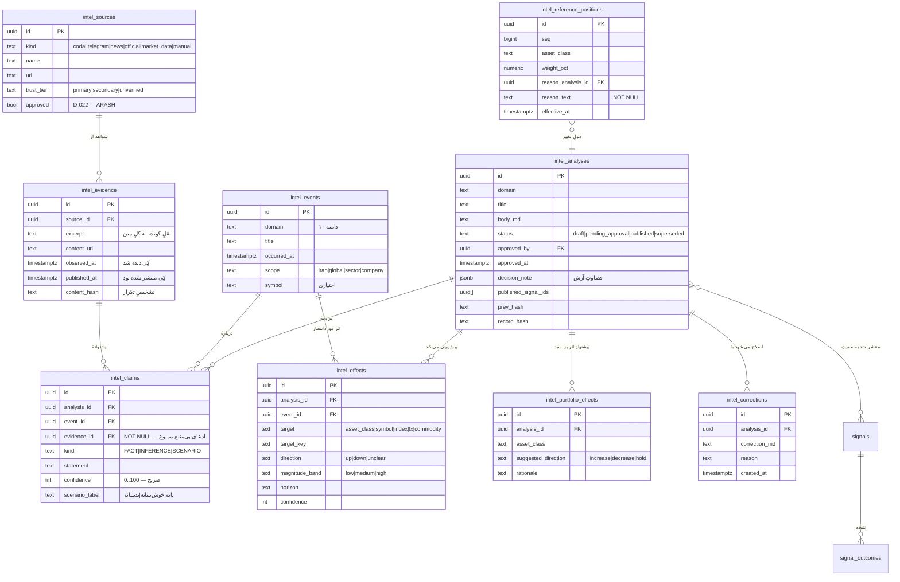

# ADR-005 — مدلِ دادهٔ هوشمندیِ بازار (`G3-001`)

| | |
|---|---|
| **وضعیت** | **PROPOSED** — طراحی، بدونِ اجرا. هیچ migrationی اعمال نشده |
| **تاریخ** | ۱۴۰۵/۰۵/۰۸ (2026-07-30) |
| **مأموریت** | `P2-G2-010` Wave 4 |
| **تصمیم‌گیرنده** | Command Center (معماری) · ARASH (دامنه و انتشار) |
| **migration** | `sql/phase20_intelligence_model.sql` — **`NOT_APPLIED`** |
| **پیش‌نیازِ اجرا** | بسته‌شدنِ ریسک‌های Gate 2 (`DD-024`) |

> این ADR **سیستمِ موازی نمی‌سازد.** بیشترِ زنجیره از قبل وجود دارد؛ آنچه کم است
> نیمهٔ **بالادستِ** آن است. هر جدولی که پیشنهاد می‌شود باید توضیح دهد چرا
> جدولِ موجود کافی نبود.

---

## ۱. مسئله

امروز محصول می‌تواند **تحلیلِ منتشرشده** و **نتیجه‌اش** را نگه دارد
(`signals` + `signal_outcomes`، append-only با هشِ زنجیره‌ای). چیزی که نمی‌تواند
نگه دارد، **راهی است که به آن تحلیل رسیده‌ایم**:

- خبر از کجا آمد و کِی؟
- چه چیزی **واقعیت** بود، چه چیزی **استنباط**، چه چیزی **سناریو**؟
- اطمینانِ آرش چقدر بود؟
- انتظار داشتیم روی کدام بازار چه اثری بگذارد؟
- روی **سبدِ مرجع** چه اثری داشت؟
- بعداً چقدر درست از آب درآمد، و اصلاحش کجا ثبت شد؟

بدونِ این، کارنامه می‌گوید «چه گفتیم» ولی نمی‌گوید «چرا گفتیم» — و همان «چرا»
چیزی است که Gate 4 (عاملِ کمکی) و Gate 7 (رونمایی) به آن تکیه می‌کنند.

---

## ۲. فهرستِ دارایی‌های موجود (بازبینیِ واقعی، ۲۰۲۶-۰۷-۳۰)

| دارایی | چیست | حکم |
|---|---|---|
| `signals` | تحلیلِ منتشرشدهٔ سطحِ نماد · append-only · هشِ زنجیره‌ای · `direction`, `entry_price`, `reasons`, `scores`, `approved_by` | **REUSE** — همین **کارنامهٔ عمومی** است |
| `signal_outcomes` | نتیجهٔ بسته‌شدن · append-only · هشِ زنجیره‌ای | **REUSE** |
| `signal_drafts` | پیش‌نویسِ سیگنال از موتور؛ فقط ادمین؛ تأیید/رد | **REUSE** — الگویِ صندوقِ تأیید از قبل هست |
| `weekly_outlooks` + `weekly_outlook_results` | چشم‌اندازِ هفتگی با `drivers`, `assumptions`, `engine_snapshot` · append-only | **REUSE** — همین «سناریو در سطحِ بازار» است |
| `market_notes` | یادداشتِ کوتاهِ بازار · append-only | **REUSE** |
| `content_hub` | فیدِ تلگرام/اینستاگرام با `content_url`, `published_at` | **EXTEND** — یک **منبع** است |
| `codal_reports` / `codal_feed` | گزارش‌های کدال (append-only طبق CLAUDE.md) | **EXTEND** — منبعِ رخدادِ شرکتی |
| `ir_market_snapshots` / `symbol_history` | دادهٔ بازار | **REUSE** بدونِ تغییر — مرجعِ عدد |
| `fx_rates` / `fx_heavy_analytics` | ارز و طلا + GARCH/PSY | **REUSE** |
| `market_breadth`, `index_history` | رژیم و پهنا | **REUSE** — ورودیِ `computeRegime` |
| `lib/core/regime.ts` | `computeRegime()` | **REUSE** — موتورِ رژیم |
| `lib/core/allocation.ts` | `runAllocation()` | **REUSE** — موتورِ تخصیص |
| `portfolios`, `portfolio_versions`, `portfolio_snapshots`, `holdings` | سبدِ **کاربر** | **REUSE، دست‌نخورده** — سبدِ مرجعِ آرش چیزِ دیگری است |
| `audit_log` | `actor_id, action, entity, before, after` · append-only | **REUSE** — ثبتِ اقدامِ انسانی |
| `profiles.role` | نقشِ ادمین | **REUSE** — منبعِ واحدِ اجازه |
| `public.deny_mutation()` | تریگرِ append-only | **REUSE** — دوباره ننویس |

**نتیجه:** نیمهٔ پایین‌دستِ زنجیره (تحلیل → تأیید → انتشار → نتیجه → کارنامه)
**از قبل ساخته شده**. آنچه واقعاً جدید است، نیمهٔ بالادست است.

---

## ۳. تصمیم

هفت جدولِ جدید با پیشوندِ `intel_`، به‌علاوهٔ **دو پلِ** ارجاعی به دارایی‌های
موجود. هیچ جدولِ موجودی تغییرِ ساختار نمی‌دهد.

### زنجیره و نگاشتش

```
Source ──────────────► intel_sources        (جدید)
Evidence ────────────► intel_evidence       (جدید)
Market/Event ────────► intel_events         (جدید)
Fact/Inference/Scenario ► intel_claims      (جدید)
Analysis ────────────► intel_analyses       (جدید — سطحِ روایت، نه سطحِ نماد)
Expected Market Effects ► intel_effects     (جدید)
Reference Portfolio Effects ► intel_portfolio_effects + intel_reference_positions (جدید)
Arash Decision ──────► intel_analyses.decision_* + audit_log        (پل)
Approval/Publication ► intel_analyses.status + signals              (پل)
Outcome/Correction ──► signal_outcomes + intel_corrections          (پل)
Track Record ────────► signals + signal_outcomes  (بدونِ تغییر)
```

### چرا `intel_analyses` جدا از `signals`

`signals` **سطحِ نماد** است: `symbol NOT NULL`, `direction check (buy|sell)`.
تحلیلِ کلان («تغییرِ رژیمِ ارزی»، «اثرِ یک تصمیمِ سیاستی») نه نماد دارد نه جهت.
فشردنِ آن در `signals` یا ستون‌ها را دروغین می‌کند یا `direction` را بی‌معنا.

پس: `intel_analyses` روایت را نگه می‌دارد؛ وقتی یک تحلیل به گزارهٔ سطحِ نماد
رسید، ردیفی در `signals` منتشر می‌شود و `signals.id` در
`intel_analyses.published_signal_ids` ثبت می‌گردد. **کارنامهٔ عمومی همچنان فقط
`signals` است** — رقیب ندارد.

---

## ۴. مدلِ روابط (ERD)



---

## ۵. ده دامنهٔ پوشش‌داده‌شده

`intel_events.domain` و `intel_analyses.domain` هر دو از همین فهرست:

| کلید | دامنه |
|---|---|
| `politics_geo` | سیاست و ژئوپلیتیک |
| `macro_ir` | اقتصادِ کلانِ ایران |
| `macro_global` | اقتصادِ کلانِ جهان |
| `fx_gold` | نرخِ ارز و طلا |
| `equity_ir` | سهام و صنایعِ ایران |
| `company_codal` | شرکت‌ها و گزارش‌های کدال |
| `fixed_income` | درآمدِ ثابت |
| `commodity_funds` | صندوق‌های کالایی و گواهیِ سپرده |
| `capital_risk` | ریسکِ سرمایه |
| `allocation` | تخصیصِ دارایی و سبدِ مرجع |

---

## ۶. قواعدِ غیرقابل‌مذاکره و جای اجرای هرکدام

| قاعده | کجا اجرا می‌شود |
|---|---|
| `FACT`/`INFERENCE`/`SCENARIO` جدا | `intel_claims.kind` با `CHECK`؛ ستونِ جدا، نه برچسبِ متنی |
| هر ادعا منبع و زمان دارد | `evidence_id NOT NULL` + `observed_at NOT NULL` |
| Confidence صریح | `confidence integer NOT NULL CHECK (0..100)` — `null` مجاز نیست، «نمی‌دانم» یعنی عددِ پایین با ذکرِ دلیل |
| اصلاح تاریخچه را پاک نمی‌کند | `intel_analyses` و `intel_claims` تریگرِ `deny_mutation` دارند؛ اصلاح **ردیفِ تازه** در `intel_corrections` است |
| تصمیمِ سبد append-only | `intel_reference_positions` با `seq` و `deny_mutation`؛ `reason_text NOT NULL` |
| اثر از رخداد جدا | `intel_effects` جدولِ مستقل با FK به هر دو — یک رخداد چند اثر دارد و هر اثر اطمینانِ خودش |
| تحلیلِ منتشرشده بازنویسی نمی‌شود | append-only + `status='superseded'` + ردیفِ `intel_corrections` |
| قابلِ اتصال به Agent در آینده | `intel_evidence.content_hash` و `intel_sources.approved` از قبل هستند؛ ولی **هیچ Agentی ساخته نمی‌شود** |
| دادهٔ خامِ مالی به LLM نمی‌رود | مدل هیچ ستونِ عددیِ خامِ قیمتی ندارد؛ `magnitude_band` **باند** است نه عدد. عبور از `qualitativeMask` قانونِ CLAUDE.md است و اینجا هم برقرار می‌ماند |
| با کارنامهٔ موجود رقابت نمی‌کند | کارنامه فقط `signals` + `signal_outcomes`؛ `intel_analyses` به آن **ارجاع** می‌دهد |

---

## ۷. ماتریسِ Existing / Extend / New

| مؤلفه | حکم | دلیل |
|---|---|---|
| کارنامهٔ عمومی | **EXISTING** | `signals` + `signal_outcomes` کافی‌اند |
| صندوقِ تأیید | **EXISTING (الگو)** | `signal_drafts` الگو را دارد؛ `intel_analyses.status` همان را برای روایت تکرار می‌کند |
| چشم‌اندازِ هفتگی | **EXISTING** | `weekly_outlooks` سناریوی سطحِ بازار است |
| موتورِ رژیم/تخصیص | **EXISTING** | `lib/core/regime.ts`, `allocation.ts` |
| فیدِ محتوا | **EXTEND** | `content_hub` به‌عنوانِ یک `intel_source` ثبت می‌شود؛ ساختارش عوض نمی‌شود |
| کدال | **EXTEND** | `codal_reports` منبعِ رخدادِ شرکتی؛ append-only می‌ماند |
| منبع/شاهد/رخداد/ادعا | **NEW** | هیچ معادلی ندارد |
| اثرِ بازار/سبد | **NEW** | امروز اثر از رخداد جدا نیست |
| سبدِ مرجعِ آرش | **NEW** | `portfolios` سبدِ **کاربر** است؛ قاطی‌کردنشان RLS را خراب می‌کند |
| اصلاحات | **NEW** | امروز جایی برای «اشتباه کردم، این شد» نیست |

---

## ۸. نگاشت به ۹ بخشِ Arash Desk

| بخشِ میز | از کجا خوانده می‌شود | جدید؟ |
|---|---|---|
| ۱. امروز چه اتفاقی افتاده؟ | `intel_events` (امروز) + `ir_market_snapshots` + `fx_rates` | نیمه |
| ۲. اخبار و رخدادهای مهم | `intel_events` + `intel_evidence` + `content_hub` | نیمه |
| ۳. تغییرِ رژیم و سناریوها | `weekly_outlooks` + `computeRegime()` + `intel_claims(kind='SCENARIO')` | نیمه |
| ۴. رادارِ بازارها | `lib/core/marketRadar.ts` + `market_breadth` + `index_history` | **موجود** |
| ۵. شرکت‌ها و کدال | `codal_reports` + `intel_events(domain='company_codal')` | نیمه |
| ۶. اثر بر سبدِ مرجع | `intel_portfolio_effects` + `intel_reference_positions` | **جدید** |
| ۷. تحلیل‌های در انتظارِ تأیید | `intel_analyses(status='pending_approval')` + `signal_drafts` | نیمه |
| ۸. مشتریان و اقداماتِ ضروری | `leads` + `entitlements` + `payments` | **موجود** (ولی `B-001` باز) |
| ۹. سلامتِ سامانه | `/api/admin/health` + `lib/health/status.ts` | **موجود** |

چهار بخش از نُه بخش عملاً از قبل داده دارند. این عمدی است: میز باید **لایهٔ
تجمیع** باشد، نه موتورِ تازه (`G3-002`).

---

## ۹. Threat model (کوتاه)

| تهدید | چرا مهم است | کنترل |
|---|---|---|
| نشتِ تحلیلِ منتشرنشدهٔ آرش | مزیتِ تحلیلی و اعتبار | RLS: فقط `profiles.role='admin'`؛ `status<>'published'` هیچ سیاستِ عمومی ندارد |
| دستکاریِ کارنامه پس از انتشار | کلِ ارزشِ محصول اعتمادپذیریِ کارنامه است | append-only + هشِ زنجیره‌ای (از قبل روی `signals`) + `deny_mutation` روی جدول‌های جدید |
| ادعای بی‌منبع | ریشهٔ «توهمِ مدل» | `evidence_id NOT NULL` در سطحِ اسکیما، نه در سطحِ اپلیکیشن |
| بالا رفتنِ `anon`/`authenticated` | همان درسِ `G2-006` | `REVOKE ALL` از هر سه، سپس گرنتِ صریح؛ **و `TRUNCATE` هرگز به `authenticated`** — RLS جلویش را نمی‌گیرد |
| رفتنِ عددِ خامِ مالی به LLM | قانونِ CLAUDE.md | مدل عددِ قیمتیِ خام ندارد؛ فقط باندِ کیفی |
| منبعِ تأییدنشده | `D-022` | `intel_sources.approved boolean` — پیش‌فرض `false` |
| دادهٔ شخصیِ لید در مسیرِ هوشمندی | حریمِ خصوصی | مدل هیچ FKی به `leads` ندارد. عمدی |

---

## ۱۰. برنامهٔ Rollback

migration فقط **جدولِ تازه** می‌سازد و هیچ شیٔ موجودی را تغییر نمی‌دهد، پس
برگشت بی‌خطر است **اگر جدول‌ها خالی باشند**:

```sql
BEGIN;
DROP TABLE IF EXISTS public.intel_corrections;
DROP TABLE IF EXISTS public.intel_reference_positions;
DROP TABLE IF EXISTS public.intel_portfolio_effects;
DROP TABLE IF EXISTS public.intel_effects;
DROP TABLE IF EXISTS public.intel_claims;
DROP TABLE IF EXISTS public.intel_analyses;
DROP TABLE IF EXISTS public.intel_events;
DROP TABLE IF EXISTS public.intel_evidence;
DROP TABLE IF EXISTS public.intel_sources;
COMMIT;
```

⚠️ اگر تحلیلِ واقعیِ آرش داخلشان باشد، `DROP` **ممنوع** است — همان قاعدهٔ
`phase8b_leads`: مسیر را ببند، داده را نگه دار.

---

## ۱۱. تست‌های لازم پیش از اجرا

۱. همان دو پروفایلِ امتیازِ `G2-006` روی هر ۹ جدول (`legacy` و `explicit`).
۲. `anon` هیچ‌کدام را نمی‌خوانَد.
۳. کاربرِ عادیِ لاگین‌کرده هیچ تحلیلِ منتشرنشده‌ای نمی‌بیند.
۴. `authenticated` روی هیچ‌کدام `TRUNCATE`/`DELETE` ندارد.
۵. `UPDATE`/`DELETE` روی `intel_analyses` و `intel_claims` با `deny_mutation` رد شود.
۶. `intel_claims` بدونِ `evidence_id` درج نشود.
۷. `confidence` خارج از ۰..۱۰۰ رد شود.
۸. `kind` خارج از سه مقدار رد شود.
۹. `intel_reference_positions` فقط append بپذیرد و `reason_text` اجباری باشد.
۱۰. گاردِ failability: نسخهٔ بدونِ `deny_mutation` واقعاً اجازهٔ بازنویسی بدهد.

---

## ۱۲. آنچه این ADR **نمی‌کند**

- هیچ Agent، هیچ اتصالِ LLM، هیچ منبعِ خبریِ انتخاب‌شده (`D-022`, `D-023` باز)
- هیچ صفحهٔ عمومیِ تازه، هیچ بازطراحیِ Homepage
- هیچ داشبوردِ موجودی حذف نمی‌شود
- هیچ migrationی اجرا نمی‌شود — نه Production، نه Staging
- `G3-002` (خودِ میز) شروع نمی‌شود
