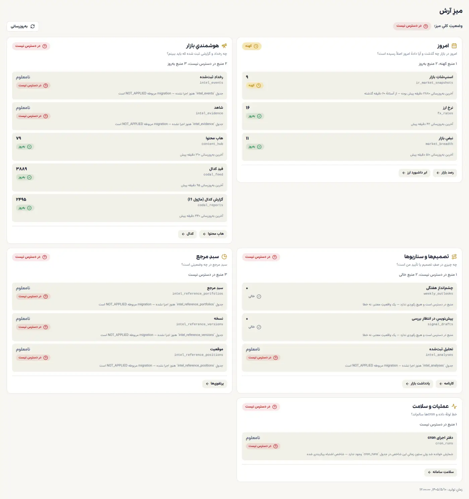
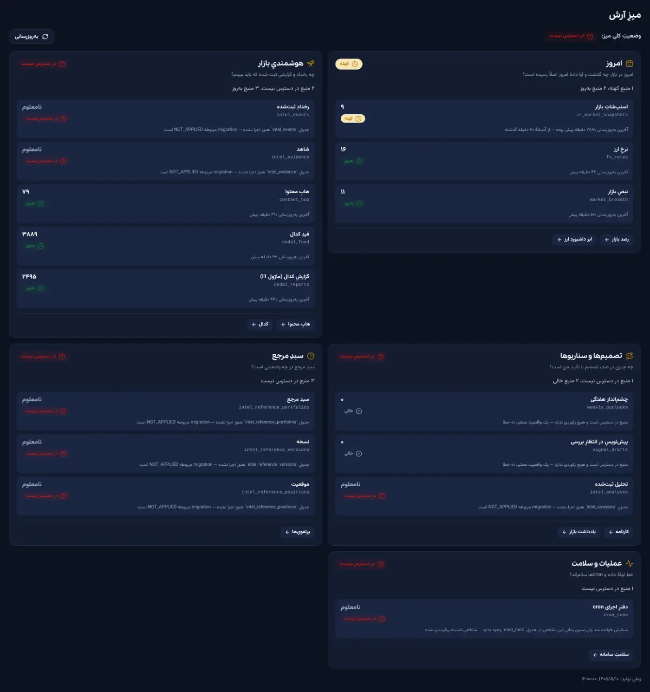
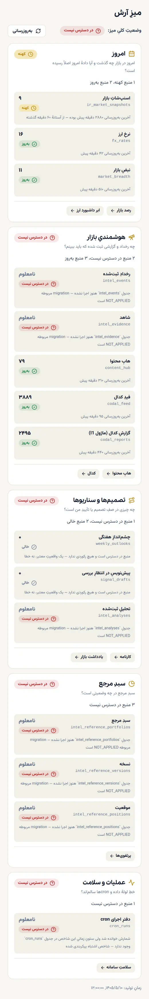
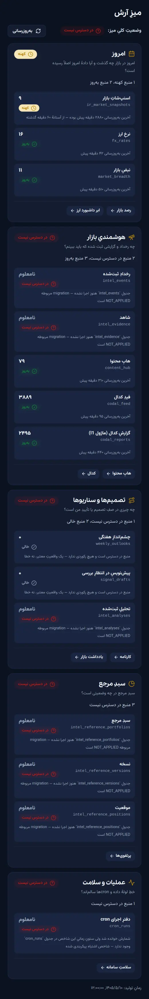

# میزِ آرش — گزارشِ بصری

> مأموریت: `P2-G3-MEGA-004` · PR #101 · وضعیت: **Draft، merge‌نشده**
>
> تصاویر داخلِ همین مخزن‌اند (`docs/assets/desk/`) و روی GitHub بدونِ هیچ
> حسابِ دیگری دیده می‌شوند.

---

## ⚠️ این تصاویر چه چیزی را اثبات نمی‌کنند

پیش از هر چیز، چون تصویر متقاعدکننده‌تر از آن است که باید:

- **پاسخِ API ساختگی (mock) است.** `/api/admin/desk` با یک payload جایگزین شده
  تا هر چهار حالت هم‌زمان دیده شوند. این **پیش‌نمایشِ احرازشده روی دیتابیسِ
  زنده نیست** و دربارهٔ کارکردِ گیتِ ادمین در زمانِ اجرا **هیچ** نمی‌گوید.
- **کامپوننت اما واقعی است.** رندر با خودِ `components/admin/DeskBoard.tsx`
  انجام شده، نه با یک نمونهٔ جداگانه.
- **استقرارِ Vercel بررسی نشد** — پراکسیِ محیطِ اجرا `*.vercel.app` را مسدود
  می‌کند (`B-030`).

---

## چهار حالت

| نشان | معنا | شمارش |
|---|---|---|
| 🟢 **به‌روز** | داده هست و از آستانهٔ تازگی نگذشته | عدد واقعی |
| 🟡 **کهنه** | داده هست ولی از آستانه گذشته | عدد واقعی |
| ⚪ **خالی** | منبع در دسترس است و **واقعاً** رکوردی ندارد — یک واقعیتِ معتبر | **صفرِ واقعی** |
| 🔴 **در دسترس نیست** | نتوانستیم بپرسیم؛ دربارهٔ واقعیت هیچ نمی‌گوید | **`null` — هرگز صفر** |

ترتیبِ بدترین‌بودن عمداً غیرِشهودی است:
**در دسترس نیست ← خالی ← کهنه ← به‌روز.**
دادهٔ کهنه دستِ‌کم یک‌بار وجود داشته؛ منبعِ نادیدنی هیچ نمی‌گوید.

---

## دسکتاپ ۱۴۴۰×۹۰۰ — تمِ روشن

هر پنج ناحیه با هر چهار حالت هم‌زمان. بخشِ «امروز» **کهنه** است چون
اسنپ‌شاتِ رله کهنه است — با اینکه دو منبعِ همسایه‌اش به‌روزند. این دقیقاً
همان چیزی است که نسخهٔ قبلی پنهان می‌کرد.

## دسکتاپ ۱۴۴۰×۹۰۰ — تمِ تیره

همان نما پس از رفعِ `B-040`. پیش از این، عنوان‌ها با `--navy-deep` رنگ
می‌شدند که تمِ تیره بازنویسی‌اش نمی‌کند و تقریباً نامرئی بودند.

## موبایل ۳۹۰×۸۴۴ — تمِ روشن

تک‌ستونی، بدونِ سرریزِ افقی. هیچ ردیفی حذف نمی‌شود — همان پنج ناحیه و همان
چهارده منبع.

## موبایل ۳۹۰×۸۴۴ — تمِ تیره

لینک‌های ادامهٔ کار در پایینِ هر کارت باقی می‌مانند؛ میز جای داشبوردها را
نمی‌گیرد، به آن‌ها راه می‌دهد.

---

## آنچه در هر چهار نما اندازه‌گیری شد

| نما | سرریزِ افقی | `dir` / `lang` | حالت‌ها | «نامعلوم» | صفرِ واقعی | خطای JS |
|---|---|---|---|---|---|---|
| دسکتاپ روشن | ندارد | `rtl` / `fa` | ۴ از ۴ | ۷ | ۲ | ۰ |
| دسکتاپ تیره | ندارد | `rtl` / `fa` | ۴ از ۴ | ۷ | ۲ | ۰ |
| موبایل روشن | ندارد | `rtl` / `fa` | ۴ از ۴ | ۷ | ۲ | ۰ |
| موبایل تیره | ندارد | `rtl` / `fa` | ۴ از ۴ | ۷ | ۲ | ۰ |

- **۷ «نامعلوم»** = هفت منبعِ نادیدنی (`count: null`) — دو `intel_*` در
  هوشمندی، `intel_analyses`، سه جدولِ سبدِ مرجع، و `cron_runs`.
- **۲ صفرِ واقعی** = `weekly_outlooks` و `signal_drafts` که روی Production
  واقعاً خالی‌اند.

**مقدارِ ناموجود هرگز صفر نمی‌شود، و صفرِ واقعی هرگز پنهان نمی‌شود.**
هر هشت لینکِ کارت‌ها به مقصدِ موجود می‌رسند — با تست بررسی شد.

---

## آستانهٔ تازگی — دقیقاً یک عدد

بازبینیِ Command Center یک ناسازگاری پیدا کرد: قرارداد `okWithinMinutes` **و**
`staleWithinMinutes` داشت، ولی `classifySource()` فقط اولی را می‌خواند. عددِ
دوم **هیچ اثرِ اجرایی نداشت**.

| سن | حالت |
|---|---|
| `age <= freshWithinMinutes` | `ready` |
| `age > freshWithinMinutes` | `stale` |

`staleWithinMinutes` حذف شد و سه گارد جلوی بازگشتش را می‌گیرند.
جزئیات در [`DESK-SOURCE-MATRIX.md`](DESK-SOURCE-MATRIX.md) بخشِ ۸.

**آستانهٔ کدال:** ۷ روز، **موقت و محافظه‌کارانه**. این عدد cadence واقعی
نیست و پس از مشخص‌شدنِ قراردادِ رله باید بازبینی شود.

---

## پیوندها

- ماتریسِ کاملِ منابع: [`DESK-SOURCE-MATRIX.md`](DESK-SOURCE-MATRIX.md)
- رانبوکِ تمرینِ خصوصی: [`RUNBOOK-arash-desk-private-rehearsal.md`](RUNBOOK-arash-desk-private-rehearsal.md)
- برنامهٔ Gate 3: [`PLAN-gate3-arash-desk-mvp.md`](PLAN-gate3-arash-desk-mvp.md)

**Gate 3 پاس نشده و تمرینِ ده‌روزه شروع نشده است.**
