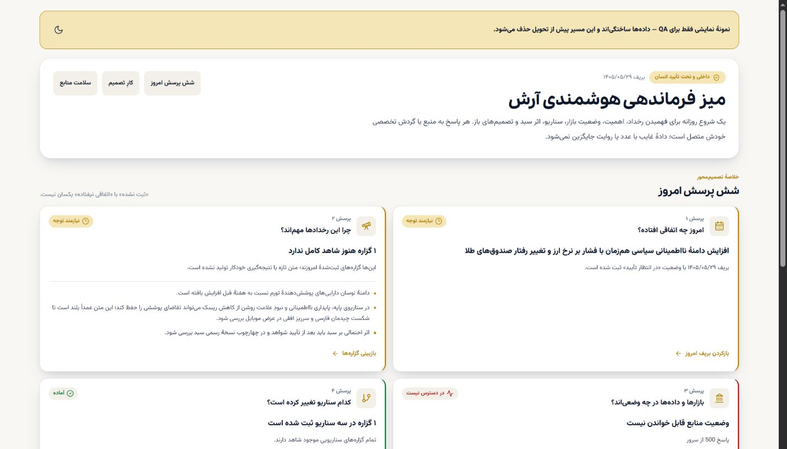
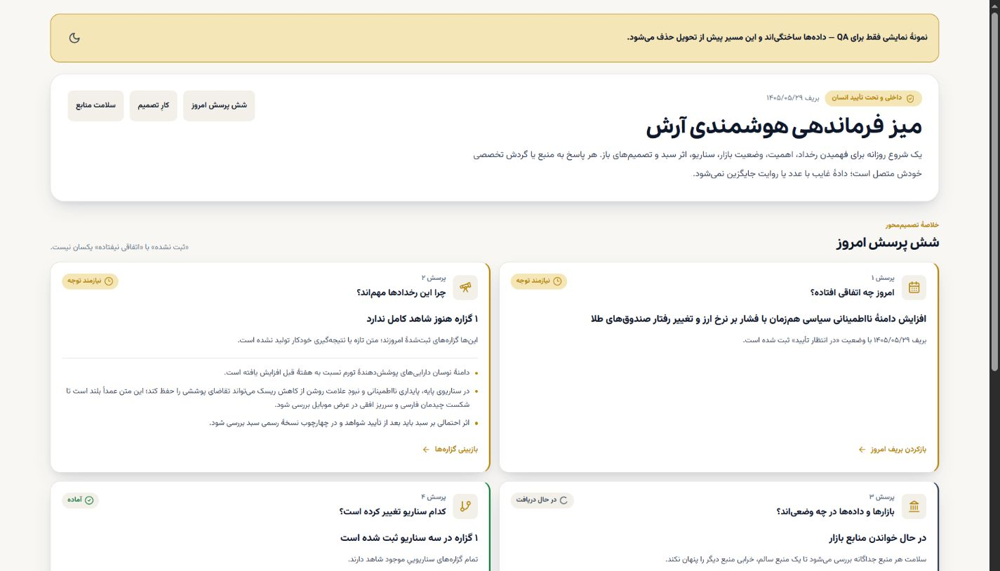
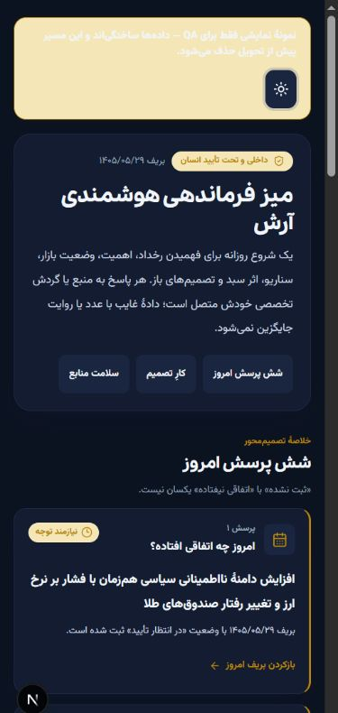
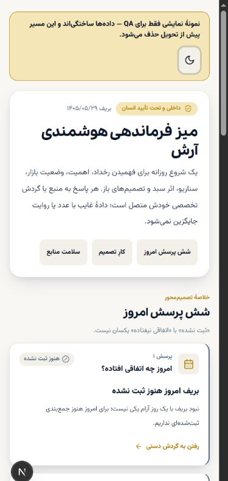
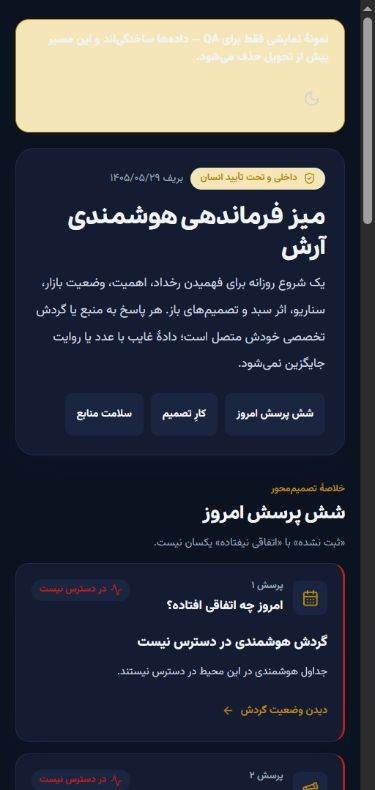

# عقلانی‌سازی میز هوشمندی — Waves A تا D

> **نقش سند:** مرجع اجراییِ یکپارچه‌سازی تجربهٔ داخلی. جهت محصول همچنان در
> `PRODUCT-BLUEPRINT.md`، وضعیت زنده در `COMMAND-CENTER.md` و تصمیم‌ها در
> `DECISION-LOG.md` است. این سند هیچ تصمیم تجاری تازه‌ای ثبت نمی‌کند.

## اصل معماری

`/admin/desk` تنها نقطهٔ شروع روزانه است. موتورهای رادار، ارز، گردش هوشمندی،
کدال، کارنامه، پرتفوی و سلامت حذف نمی‌شوند؛ به‌عنوان عمق بعدی و منبع پاسخ‌های
میز باقی می‌مانند. دادهٔ غایب `null`/خالی/در دسترس نیست می‌ماند و هیچ خلاصه،
عدد، نتیجه‌گیری یا وزن جایگزین ساخته نمی‌شود.

## Wave A — ماتریس عقلانی‌سازی تجربه

| مسیر / کامپوننت | سؤال یا اقدام اصلی | منبع فعلی | وضعیت پیش از این تغییر | تصمیم | نقش نهایی / مسیر برگشت |
|---|---|---|---|---|---|
| `/admin/desk` | شروع روز و سلامت منابع | `/api/admin/desk` + جدول‌های ثبت‌شده در `lib/desk/sources.ts` | واقعی، اما فقط شمارش و تازگی | **MERGE INTO UNIFIED DESK** | صفحهٔ اصلی شش‌سؤالی؛ سلامت منابع در پایین صفحه حفظ می‌شود |
| `DeskBoard` | آیا داده و cron قابل اتکاست؟ | همان API | واقعی، با چهار حالت صادق | **KEEP AS ENGINE** | لایهٔ عملیات؛ همچنان به‌تنهایی قابل استفاده است |
| `/admin/intelligence` | ثبت، بازبینی و تمرین دستی | `intel_*` و `phase22` | واقعی یا صریحاً unavailable | **DRILL-DOWN** | گردش تخصصی و تاریخچه؛ منبع داده‌اش با Desk مشترک است |
| `IntelligenceDesk` | بریف، صف، سناریو، اثر سبد و تمرین | `lib/intelligence/board.ts` | واقعی، اما صفحهٔ شروع جدا | **MERGE VIEW / KEEP ENGINE** | در Desk نمایش داده می‌شود و مسیر تخصصی نیز حفظ می‌شود |
| `/admin/radar` | پهنا، جریان و نقاط غیرعادی بازار | `lib/core/marketRadar.ts` | موتور واقعی | **DRILL-DOWN** | از پرسش وضعیت بازار و کارت موتورهای تخصصی باز می‌شود |
| `/admin/fx` | تحلیل تخصصی ارز | موتورهای `lib/fx/` | موتور واقعی | **DRILL-DOWN** | از وضعیت بازار و موتورهای تخصصی باز می‌شود |
| `/codal` | اطلاعیه و گزارش شرکت‌ها | `codal_feed` / رله | واقعی با stateهای موجود | **DRILL-DOWN** | شاهد شرکتی و ورودی هوشمندی؛ حذف یا کپی نمی‌شود |
| `/admin/analyses` | کارنامه و تاریخ تحلیل | `signals` و outcome | واقعی، تاریخچه مستقل | **DRILL-DOWN** | اثبات و بازبینی نتیجه، نه صفحهٔ شروع روز |
| `/admin/notes` | یادداشت بازار | `notes` | واقعی | **DRILL-DOWN** | یادداشت و زمینهٔ انسانی زیر هوشمندی |
| `/admin/content` | محتوای شبکه و انتشار | `content_hub` | واقعی یا خالی | **DRILL-DOWN** | مسیر محتوا؛ نتیجهٔ Desk خودکار به آن منتشر نمی‌شود |
| `/admin/manage?tab=portfolio` | مدیریت پرتفوی و نسخه‌ها | جداول پرتفوی | واقعی، مشتری/عملیات | **DRILL-DOWN** | جزئیات سبد و مشتری؛ Desk فقط اثر احتمالی را نشان می‌دهد |
| `/admin/health` | سلامت اجرایی سامانه | Health API و cron ledger | واقعی | **DRILL-DOWN** | عمق عملیات؛ وضعیت خلاصه در Desk دیده می‌شود |
| `/admin` | آمار کلی مدیریت | آمار کاربران/کسب‌وکار | واقعی اما روزانه‌محور نیست | **DEMOTE** | زیر گروه «عملیات سامانه» با عنوان «نمای مدیریتی» |
| `AdminShell` | دسترسی به همهٔ مسیرها | route navigation | ۱۵ ورودی تخت | **RATIONALIZE** | چهار گروه: شروع روز، موتورهای هوشمندی، مشتری و درآمد، عملیات |
| صفحات عمومی `/market/*` | جذب و مشاهدهٔ عمومی بازار | دادهٔ بازار موجود | واقعی و دارای ارزش SEO | **KEEP PUBLIC** | خارج از بازطراحی داخلی؛ منبع داده مشترک، تجربه مستقل |

هیچ حذف فایلی در این Wave انجام نشده است. `DEMOTE` یعنی کاهش اولویت در ناوبری،
نه حذف قابلیت. گزینهٔ برگشت برای تمام تغییرات، بازگرداندن صفحه و گروه‌بندی قبلی
بدون دست‌زدن به داده یا قراردادهای دیتابیس است.

## Wave B — جریان شش‌سؤالی Desk

| ترتیب | سؤال | پاسخ از کجا می‌آید؟ | حالت‌های صادق |
|---:|---|---|---|
| ۱ | امروز چه اتفاقی افتاده؟ | بریف همان روز در `intel_analyses` | ثبت‌شده · ثبت‌نشده · unavailable |
| ۲ | چرا مهم است؟ | گزاره‌های همان بریف + تعداد شاهد | کامل · نیازمند شاهد · بدون گزاره · unavailable |
| ۳ | بازارها و داده‌ها در چه وضعی‌اند؟ | وضعیت مستقل snapshot/FX/breadth + اثرهای ثبت‌شده | ready · stale · empty · unavailable · loading |
| ۴ | کدام سناریو تغییر کرده است؟ | گزاره‌های `SCENARIO` در سه سناریوی مصوب | ثبت‌شده · بدون سناریو · نیازمند شاهد · unavailable |
| ۵ | اثر احتمالی بر سبد مرجع چیست؟ | آخرین نسخهٔ finalized + `intel_portfolio_effects` | نسخه رسمی · اثر ثبت‌نشده · نسخه تعریف‌نشده · unavailable |
| ۶ | چه چیزی منتظر تصمیم من است؟ | تحلیل‌های `pending_approval` و گیت شاهد | صف خالی · آماده بازبینی · مسدود به علت شاهد · unavailable |

قواعد:

- پاسخ‌ها از viewهای خالص و تست‌شده ساخته می‌شوند؛ Desk محاسبهٔ مالی ندارد.
- «بریف ثبت نشده» هرگز «روز آرام» تفسیر نمی‌شود.
- صف خالی، مدرک کامل‌بودن رصد نیست.
- نبود نسخهٔ finalized باعث نمایش وزن ۷۰/۱۵/۱۵ در کد نمی‌شود؛ تصمیم محصول باید
  از مسیر نسخه‌گذاری رسمی ثبت شود.
- تصمیم و انتشار نهایی فقط با آرش است.

## Wave C — مرز عمومی، عضو و داخلی

| سطح | مجاز | غیرمجاز / پیش‌فرض |
|---|---|---|
| عمومی | واقعیت منبع‌دار، زمان، تازگی، رخداد مهم و توضیح سادهٔ اهمیت | جمع‌بندی آرش، اثر سبد، سناریوی حساس و اقدام؛ همگی خاموش |
| عضو مسیر راه / وبینار | فقط ماژول‌هایی که آرش برای همان محصول و همان دوره فعال کرده است | دسترسی خودکار به کل Desk یا نتیجهٔ خصوصی ممنوع |
| داخلی آرش | شش سؤال، شواهد، سناریو، اثر سبد، صف تصمیم و سلامت منابع | انتشار خودکار و تغییر خودکار پرتفوی ممنوع |

هر تحلیل ابتدا داخلی است. انتخاب سطح مخاطب و فعال‌سازی ماژول باید صریح، قابل
بازبینی و مستقل از وضعیت «تأیید داخلی» باشد. این Wave فقط مرز را مشخص می‌کند؛
هیچ قابلیت عمومی یا entitlement جدیدی در این تغییر ساخته نشده است.

## Wave D — شواهد پذیرش

این نتایج روی همین تغییر و در clone مستقل Codex اجرا شده‌اند؛ سبز بودن نسخهٔ
قبلی یا گزارش یک مجری، شاهد این تغییر محسوب نشده است.

| گیت | نتیجه |
|---|---|
| TypeScript | **PASS** — `tsc --noEmit` |
| Lint | **PASS** — بدون هشدار |
| Core tests | **PASS** — ۵۴۱/۵۴۱ پس از افزودن گارد fail-closed |
| Calculation tests | **PASS** — ۷۱/۷۱ |
| Production build | **PASS** — Next.js 15.5.20 |
| Desktop / mobile RTL | **PASS** — ۱۴۴۰×۱۰۰۰ و ۳۹۰×۸۴۴، `lang=fa` و `dir=rtl` |
| Light / dark | **PASS** — هر دو تم با توکن‌های مشترک |
| Loading / empty / unavailable / error | **PASS** — هر چهار حالت در مرورگر واقعی مشاهده شد |
| Keyboard / focus / overflow | **PASS** — focus ring قابل مشاهده؛ سرریز افقی صفر؛ هدف‌های اصلی حداقل ۴۴px |

### شواهد بصری

> این تصاویر با یک مسیر موقت و صریحاً برچسب‌خوردهٔ QA و fixture ساختگی گرفته
> شدند. مسیر QA پیش از تحویل از `app/` حذف شد و هیچ دادهٔ نمونه‌ای وارد محصول،
> دیتابیس یا Production نشد. خطای منبع در این تصاویر عمدی و ناشی از نبود env
> محلی است؛ اثبات می‌کند شکست خواندن با «صفر» یا وضعیت سالم جایگزین نمی‌شود.

| حالت | شاهد |
|---|---|
| دسکتاپ روشن · دادهٔ نمونه و متن بلند فارسی |  |
| دسکتاپ · بارگذاری واقعی سلامت منابع |  |
| موبایل تیره |  |
| موبایل روشن · حالت خالی |  |
| موبایل · گردش هوشمندی ناموجود |  |

بررسی DOM نیز نشان داد: error overlay وجود ندارد، کنسول مرورگر خطای client-side
ندارد، تب «تخته سناریو» واقعاً فعال می‌شود و `aria-selected=true` می‌گیرد، و
عرض محتوای صفحه در هر دو viewport از عرض قابل مشاهده بیشتر نمی‌شود.

## محدودهٔ تغییر

- Production: **NO**
- Database / SQL / migration: **NO**
- Payment / entitlement: **NO**
- Secret / environment: **NO**
- Agent / LLM: **NO**
- Public-route redesign: **NO**

---

# تکمیلِ ماتریس — `P2-INTELLIGENCE-DESK-MEGA-001`

Waveهای A تا D مسیرهای `/admin/*` را پوشش دادند. این بخش سطوحی را اضافه می‌کند که
هنوز نقشِ مکتوب نداشتند، و ستون‌های «سطح دسترسی»، «تازگی/منشأ» و «ریسکِ صداقت» را
به ماتریس می‌افزاید.

## سطحِ دسترسی — سنجیده‌شده، نه فرض‌شده

`middleware.ts` مسیرهای `/dashboard`، `/admin` و `/terminal` را گیت می‌کند.
`/admin` و `/terminal` هر دو `profiles.role === 'admin'` می‌خواهند.
`app/(protected)/admin/layout.tsx` همان بررسی را **دوباره** انجام می‌دهد —
دفاع در عمق؛ اگر middleware دور زده شود، لایه هم redirect می‌کند.

| سطح | مسیرها | گیت |
|---|---|---|
| عمومی | `/`, `/market/*`, `/analyses`, `/insights`, `/codal`, `/data`, `/webinars`, `/about`, `/legal/*` | ندارد |
| کاربرِ واردشده | `/dashboard` | فقط session |
| **ادمین** | `/admin/*`, `/terminal/*` | session + `role='admin'` (دو لایه) |

## سطوحِ افزوده به ماتریس

| مسیر / کامپوننت | سؤالِ کاربر | منبعِ داده | سطح | ریسکِ صداقت | تصمیم | نقشِ نهایی |
|---|---|---|---|---|---|---|
| `/terminal` | نمای تحلیلگرِ عمیق | `lib/core/terminal.ts` | ادمین | کم | **DRILL-DOWN** | موتورِ بررسیِ عمیق زیرِ ناحیهٔ ۲ |
| `/terminal/[symbol]` | این نماد چه وضعی دارد؟ | engine + `symbol_history` | ادمین | کم | **DRILL-DOWN** | عمقِ نماد از رادار و کدال |
| `/terminal/allocation` | ساختارِ دارایی چه باشد؟ | `lib/core/allocation.ts` | ادمین | **متوسط** — سه سبدِ ثابت است، نه سبدِ مرجعِ نسخه‌دار | **UPGRADE → ناحیهٔ ۴** | ورودیِ مستقیمِ Wave 6؛ تا نگاشتِ ابزار نیامده، سبدِ مرجع `پیکربندی نشده` می‌ماند |
| `/terminal/watchlist` | چه چیزی را زیرِ نظر دارم؟ | `watchlist_items` | ادمین | کم | **DRILL-DOWN** | پیگیریِ شخصی |
| `/dashboard` | مشتری چه می‌بیند؟ | پرتفوی/دسترسیِ کاربر | کاربر | کم | **KEEP — خارج از دامنه** | رابطِ مشتری؛ نه میزِ داخلی |
| `app/api/admin/desk` | سلامتِ منابع | `lib/desk/sources.ts` | ادمین | کم | **KEEP AS ENGINE** | تغذیهٔ ناحیهٔ ۶ |
| `app/api/admin/intelligence` | گردشِ دستی | `intel_*` | ادمین | کم | **KEEP AS ENGINE** | تغذیهٔ ناحیه‌های ۱ و ۳ |
| `app/api/admin/health` | سلامتِ اجرایی | health + cron ledger | ادمین | **متوسط** — «جدول هست» نباید سبز تعبیر شود | **KEEP + سخت‌گیری** | Wave 8 |
| `app/api/admin/{analyses,notes,content,announcements,webinars}` | نوشتنِ محتوا | جدول‌های مربوطه | ادمین | کم | **KEEP AS ENGINE** | drill-downها |
| `app/api/admin/entitlements` | دسترسیِ مشتری | entitlement | ادمین | — | **دست‌نخورده** | مالکِ #113 |
| `app/api/admin/codal-proxy` | اطلاعیهٔ شرکت | رله/کدال | ادمین | کم | **KEEP AS ENGINE** | شاهدِ شرکتی، ناحیهٔ ۲ |
| `app/api/admin/fx/seeds` | بذرِ مدلِ ارز | جدولِ FX | ادمین | کم | **KEEP AS ENGINE** | آزمایشگاهِ ارز |
| `components/dashboard/*` (۱۲) | نمای مشتری | پرتفوی کاربر | کاربر | کم | **KEEP — خارج از دامنه** | تغییر نمی‌کند |
| `components/terminal/*` (۳) | نمودار و کارتِ امتیاز | engine | ادمین | کم | **KEEP AS ENGINE** | drill-down |
| `components/admin/*` (۲۰) | — | — | ادمین | — | **همه ارجاع‌دار — هیچ یتیمی نیست** | رجوع به `findings.md` §F-02 |

## آنچه در این Wave حذف **نشد**

هیچ فایلی. `DEMOTE` یعنی جایگاهِ ناوبری، نه حذفِ قابلیت. هیچ نامزدِ حذفی بدونِ
اثباتِ جایگزین، redirect و مسیرِ برگشت مطرح نمی‌شود (Wave 9).

## شکافِ واژگانِ حالت — ورودیِ Wave 2

امروز دو واژگانِ متفاوت وجود دارد:

```
lib/desk/contracts.ts        ready | stale | empty | unavailable          (۴)
lib/intelligence/command-desk.ts  ready | attention | empty | loading | unavailable (۵)
```

دو حالتِ لازمِ مأموریت در **هیچ‌کدام** نیست:

- `unconfigured` — تصمیمِ مالک نیامده. با «داده نداریم» یکی نیست.
- `awaiting_review` — منتظرِ قضاوتِ انسان. با «آماده» یکی نیست.

اثرِ امروزی: نبودِ نسخهٔ رسمیِ سبد `attention` می‌شود و شبیهِ خرابیِ داده به نظر
می‌رسد، در حالی که یک گلوگاهِ تصمیم است.
