# پذیرش تجربهٔ میز بازار و صندوق‌ها

> همهٔ تصاویر با نام `synthetic` یا `fixture` از دادهٔ مصنوعی و مسیر موقتِ توسعه ساخته شده‌اند؛ شاهد Production نیستند. مسیر fixture پس از آزمون از کد حذف شده است.

## مبنا و دامنه

- مبنای نخستِ بررسی: `549f9afeafc5a2cd6712d95793b4eaecc8cd5d9f`؛ مبنای نهایی پس از دریافت `#126`: `2344179`.
- PRهای `#123`، `#120`، `#122` و `#125` واقعاً در همین زنجیره ادغام شده‌اند.
- تغییرات `#126` در relay، قرارداد مصرف و `package.json` بدون بازنویسی یا تعارض حفظ شده‌اند.
- موتور رسمی میز بازار همان `lib/core/marketDesk.ts` از `#125` است. این PR موتور یا منطق مالی موازی نساخته است.
- دامنهٔ این PR: نمایش میز بازار، دیده‌بان و جزئیات صندوق، نمودار قیمت/NAV، پل حساب و حفظ مقصد ورود.

## ماتریس حالت‌های مصنوعی

| حالت | چیزی که سنجیده شد | نتیجه |
|---|---|---|
| دادهٔ معتبر و کامل | مشاهده‌ها، پوشش، فهرست صندوق، نمودار و پل حساب | PASS |
| داده کافی، بدون عبور از آستانه | پیام «موردی عبور نکرد» همراه تعداد سنجش | PASS |
| پوشش کم | تفکیک «بخش قابل‌سنجش آرام بود» از «پوشش کامل نیست» | PASS |
| قیمت تازه، NAV کهنه | برچسب کهنگی، سن NAV، آستانه و دقت زمان | PASS |
| NAV یا زمان ناموجود | پیام نبود داده بدون ساختن صفر یا حباب | PASS |
| سابقه کوتاه و شکاف‌دار | تعداد روز مشاهده‌شده، بازه تقویمی و پیام پوشش کوتاه | PASS |
| خطای API | «داده در دسترس نیست»؛ نه «بازار آرام است» | PASS |
| مهمان، عضو کامل، عضو بدون دسترسی کامل | سه نمای AccountBridge با قرارداد واقعی `AccessInfo` | PARTIAL — قرارداد backend انقضا را جدا نمی‌کند |

## کنترل‌های اجراشده

- جست‌وجوی صندوق: `کهربا`، نتیجه ۱ از ۵.
- فیلتر نوع: `طلا`، نتیجه ۳ از ۵.
- مرتب‌سازی حباب: صندوق با حباب `۷٫۴٪` در ابتدای فهرست قرار گرفت.
- انتخاب صندوق: لینک `کهربا` به مسیر canonical همان نماد رفت.
- نمودار: crosshair و برچسب تاریخ با حرکت اشاره‌گر ظاهر شد.
- محور و tooltip: هر دو از helperهای `formatJalaliShort` و `formatJalali` پروژه استفاده می‌کنند؛ مرز ۲۹ اسفند/۱ فروردین و ۳۱ فروردین/۱ اردیبهشت با تاریخ معلوم آزموده شد.
- ورود: `/login` مقصد `/market/funds?type=طلا` را حفظ کرد و لینک ثبت‌نام هم همان مقصد را ادامه داد. آزمون رفتاری تأیید می‌کند ورود موفق فقط به مقصد محلی پالایش‌شده می‌رود و ورود ناموفق جابه‌جایی ندارد.
- focus: کنترل‌های تعاملی ring قابل‌مشاهده دارند؛ دکمه‌های پل حساب و نمایش رمز حداقل ۴۴px شدند.
- RTL و overflow: در عرض‌های ۳۶۰، ۳۹۰ و ۱۴۴۰، `dir=rtl` و `scrollWidth === clientWidth`.
- console: در اجرای fixture خطای console یا warning ثبت نشد.

## شواهد مصنوعی

### ۱۴۴۰ — داده کامل

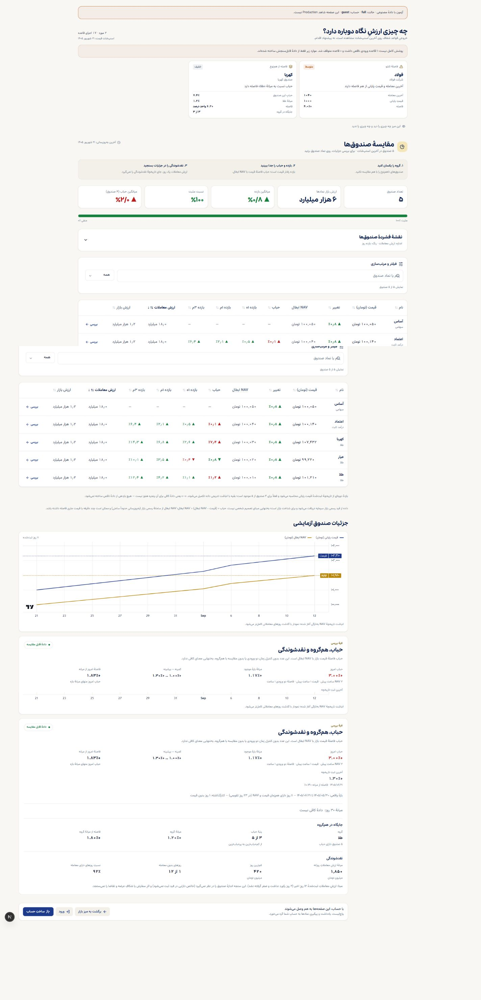

### ۳۹۰ — داده کامل

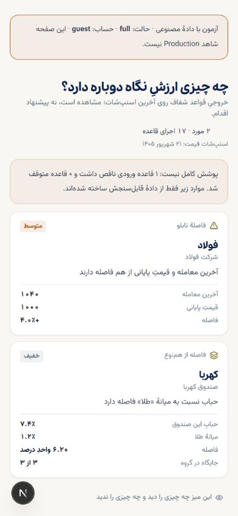

### ۳۶۰ — پوشش کم

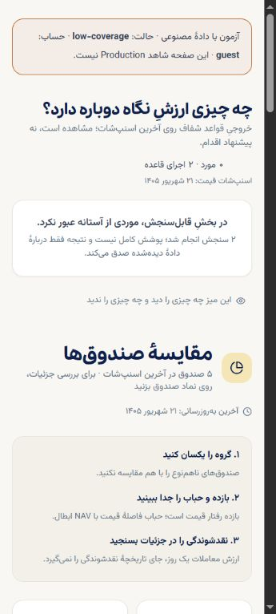

### ۱۴۴۰ — داده کافی و بدون عبور از آستانه

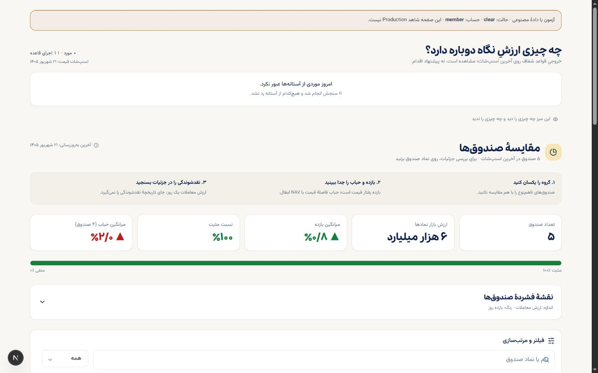

### ۳۹۰ — NAV کهنه و NAV ناموجود

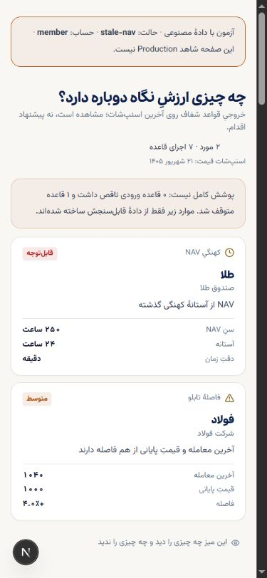

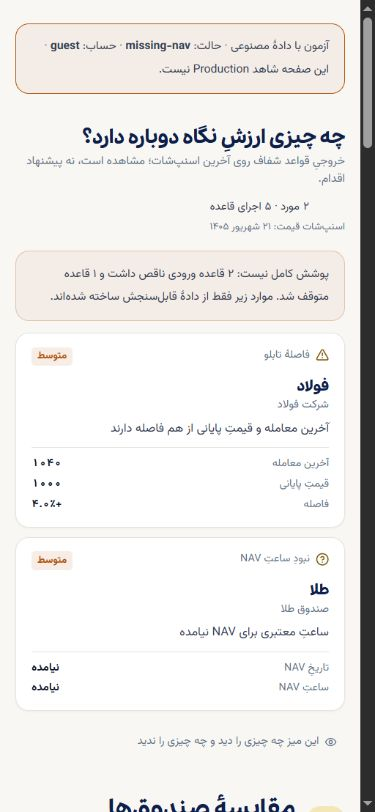

### ۳۶۰ — خطای API

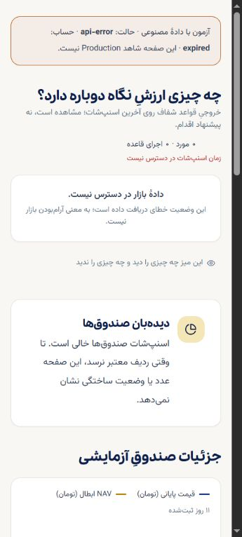

### ۱۴۴۰ — سابقه کوتاه، شکاف و tooltip

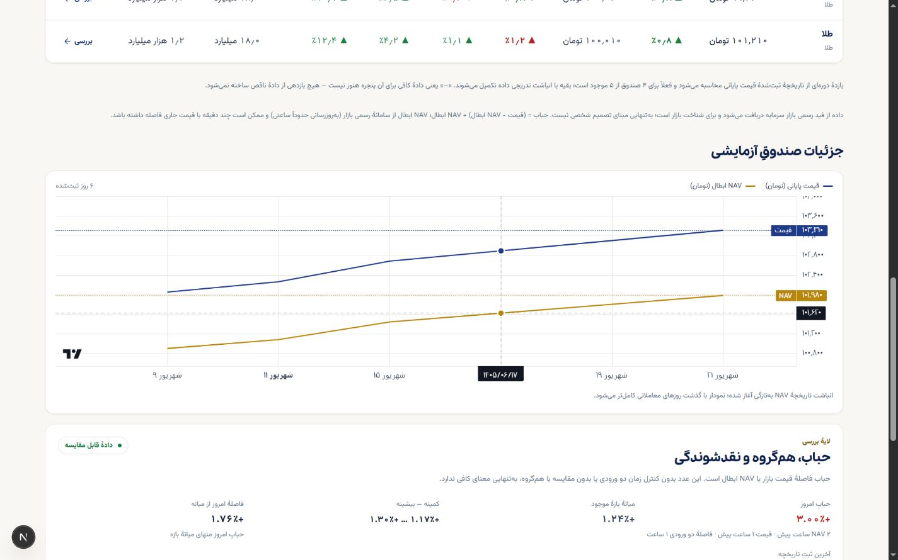

### ۱۴۴۰ — سه حالت حساب

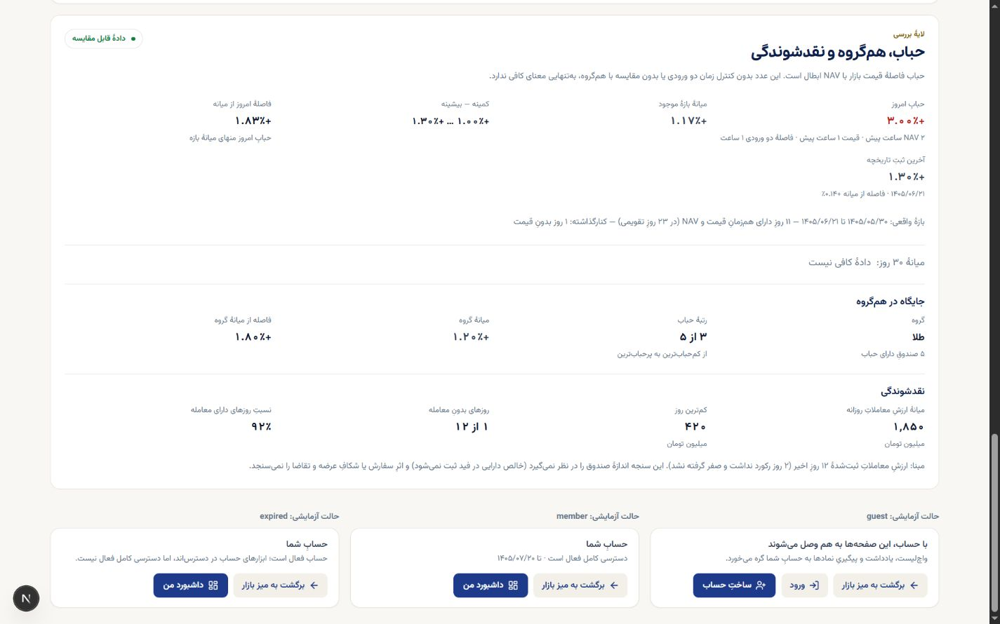

## مشاهدهٔ read-only روی Production

در `https://portfolio-platform-fawn.vercel.app` و بدون ورود یا تغییر داده:

- `/market`: اسنپ‌شات ۲۱ شهریور ۱۴۰۵، دادهٔ واقعی شاخص، طلا، دلار و ۷۵۳ نماد دیده شد؛ Market Desk و AccountBridge ادغام‌شدهٔ `#125` حاضرند.
- `/market/funds`: ۳۳۰ صندوق و اسنپ‌شات ۲۱ شهریور ۱۴۰۵ دیده شد؛ فیلتر `طلا` هشت صندوق واقعی را برگرداند.
- `/symbol/طلا`: قیمت، NAV، حباب، ۴۱ روز تاریخچه و پنل هم‌گروه/نقدشوندگی دیده شد.
- در ۳۹۰px اسکرول افقی وجود نداشت و console خطا نداد.

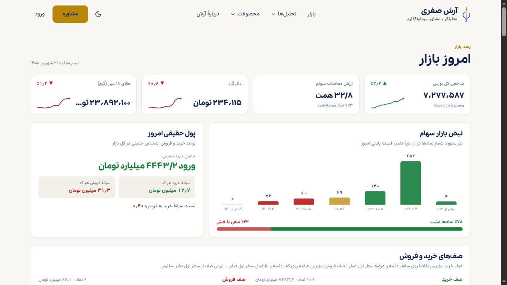

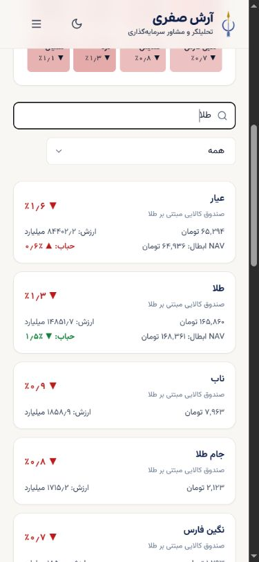

این مشاهده وضعیت دادهٔ واقعی و حضور قابلیت‌های ادغام‌شدهٔ `#125` را تأیید می‌کند؛ چون شناسهٔ deployment از خود صفحه قابل اثبات نبود، تطبیق SHA نسخهٔ Production **تأییدنشده** است. تغییرات همین PR هنوز در Production منتشر نشده‌اند.

## اشکالات باز

| شدت | مالک | اشکال | اثر |
|---|---|---|---|
| P1 | Cloud / backend | `getAccess()` کاربر منقضی را به `registered` برمی‌گرداند و علت یا زمان انقضای قبلی را در `AccessInfo` حمل نمی‌کند | UI نمی‌تواند «منقضی» را از «هرگز دسترسی کامل نداشته» صادقانه جدا کند |
| P2 | Cloud / محیط توسعه | مسیر واقعی نماد بدون env معتبر Supabase در توسعه خطای سرور می‌دهد | انتخاب مسیر تأیید شد، ولی دادهٔ واقعی فقط روی Production به‌صورت read-only تأیید شد |

هیچ‌یک از این دو مورد با حدس یا bypass در UI پوشانده نشده است.
