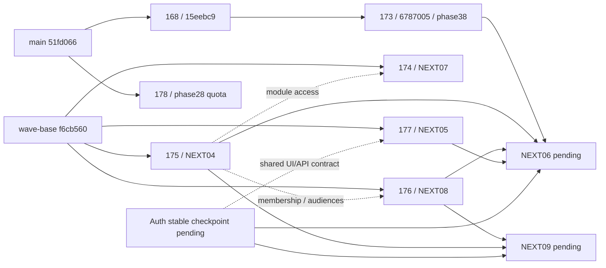

# FOLLOWUP-06 — آمادگی تجمیع و پذیرش مستقل

تاریخ: 2026-10-01، تهران. دامنه: inventory واقعی، ترکیب آزمایشی checkpointهای مشخص، regression و نصب schema در دیتابیس ساختگی جدا. **وضعیت: تجمیع نهایی پذیرفته نشده؛ SHA انتشار آماده اعلام نمی‌شود.** ورودی Auth و NEXT06 هنوز در حال ساخت‌اند؛ گیت‌های انسانی و پذیرش کامل Auth/Storage بازند.

## نسخه و محیط

- main مشاهده‌شده: `51fd0661d48d791ce8758a87828a81ce72cac6df`.
- checkout اختصاصی: `C:/Users/Asus/Documents/ChatGPT/توسعه سایت/portfolio-followup06-integration`، شاخه `codex/followup06-integration-20261001`.
- **SHA ترکیب کد آزموده‌شده: `2605a0ff11ff5cb0f83837528aed230846469b16`.** این SHA فقط checkpoint بررسی است، نه نسخه مجاز انتشار.
- مبنای موج دوم `f6cb560478d51d48dcee2c9b2801eb047f5c7214` شامل main قدیمی و #168@3462f01 بود. آن تاریخچه در ترکیب حفظ شد. اصلاح hash از `a762d853bf690e30f065a6a9f59d57d8951f2bd4` از قبل در ترکیب حاضر بود؛ cherry-pick خالی skip شد.
- محیط DB: container مستقل `liara-budget-test-followup06-20261001`، PostgreSQL 17، بدون پورت عمومی و network=none. هیچ اتصال به Liara/Preview بازیابی‌شده یا Supabase واقعی برقرار نشد.
- محیط build/regression Node 24.19.0؛ CI موجود Node22 و DB16 دارد. اختلاف محیط پنهان نشده است.
- native worktree ابزار app مرجع15eebc9 را در مخزن تحت مدیریت خود پیدا نکرد؛ ایجاد checkout با git در مخزن واقعی پروژه انجام شد. این checkout متعلق به همین مأموریت است. checkoutهای دیگر و sandbox انسانی DEV07 حفظ شدند.

## inventory سرشاخه‌ها

اطلاعات GitHub و `git ls-remote` واقعاً خوانده شدند؛ SHA کامل، base و merge-base، فایل‌ها، scripts و hashها در [inventory](followup-06-evidence/inventory.json) ثبت‌اند. همه هفت PR هنگام بررسی Draft/Open بودند؛ هیچ‌یک retarget یا merge نشد.

| بسته | PR | head دقیق | base جاری | وضعیت ورودی |
|---|---|---|---|---|
| دارایی/مشاوره DEV07 |168|15eebc97ca650dde5f2687e36d9d98d193d0d543|main@51fd066|تأیید انسانی سناریوی۵ باز؛13/0/1 متعلق به همین SHA|
| ترازنامه |173|6787005ad7b65acc49a059c2f9035ab16eb306f2|168@15eebc9|کد runtime گزارش‌شده56deb8c85a2a09009d1624cd07b78ea87535ab2a؛ تحویل بعدی docs-only؛ فهم انسانی باز|
| بازار NEXT07 |174|95cfa3410a97ac0d98cdefcb6671d4cfcb668646|wave-base@f6cb560|checkpoint فنی؛ تازگی upstream/استقرار نهایی باز|
| عضویت NEXT04 |175|bb7c2f9f89ea48929b6fd13a9dc9b16d58efa8a6|wave-base@f6cb560|Auth/Storage واقعی و شرایط تجاری باز|
| میز پژوهش NEXT08 |176|d69763563ef695b2d16ea2e52be4a4452b0811dc|wave-base@f6cb560|پذیرش مقصد با هویت واقعی باز|
| فرانت NEXT05 |177|27e59ad8d85f37da32b6f5346d289afdb73b20e6|wave-base@f6cb560|طراحی/فونت و مصرف قرارداد Auth با مالک اصلی|
| سهمیه FOLLOWUP02 |178|4ce06b3ffbd6b50125021faeb454fbf11c73b900|main@51fd066|baseline مصرف و پنجره reset واقعی نامعلوم؛ NOT DEPLOYED|
| Auth FOLLOWUP01/07 |—|checkpoint محلی7cb030c140ce143f03c549125c5e647fea22f44c|ترکیب موج دوم|تغییرات Auth ثبت‌نشده و فعال؛ کد تازه وارد ترکیب نشده|
| خانه عضو NEXT06 |درحال ساخت|ورودی پایدار نهایی تحویل نشده|173 + API04 + پوسته05 + انتشار08 + Auth|مالک عملکرد چت173؛ پذیرش PENDING|

snapshot گرفتن از تغییرات Auth فقط شامل نام فایل‌ها و checkpoint است؛ تغییرات در حال ویرایش کپی، commit یا آزموده‌شده اعلام نشدند. مالک باید PR/SHA ثابت، قرارداد API/UI و شواهد ورود ایمیل/موبایل را تحویل بدهد. ایمیل طبق DD033 حفظ می‌شود؛ SMS تولید پیش‌فرض خاموش می‌ماند. فرم تماس177 فعلاً ایمیلی است؛ تغییر موبایلی باید پس از قرارداد backend توسط مالک اصلی انجام شود.

## نقشه وابستگی و ترتیب امن

ترکیب انجام‌شده در شاخه اختصاصی: 168 →173 →175 →174 →176 →177 →178؛ dependencyهای منطقی04 قبل از مصرف‌کنندگانش نگه داشته شدند. مرحله Auth/NEXT06/NEXT09 فقط پس از checkpoint ثابت، قرارداد و مالکیت مشخص افزوده شود؛ سپس CI و regression مسیرهای متأثر روی همان SHA انجام شود. قرارداد مدل ارز با مجری ارز، داده/refresh با چت لیارا و مدل مالی173 با صاحب آن می‌ماند. این گزارش آن قراردادها را بازطراحی نکرد.

## برخوردها و مالک رفع

[file overlaps](followup-06-evidence/inventory.json) هم‌پوشانی فایل است؛ همه آنها conflict واقعی نیستند. [ثبت ترکیب](followup-06-evidence/composition.json) برخوردهای مشاهده‌شده را جدا نگه می‌دارد.

| برخورد | مشاهده/اقدام این مأموریت | مالک ادامه |
|---|---|---|
| package.json در175،174،176،178 |union فایل‌های core/DB و کلیدهای scripts؛ test:public حفظ؛ NAV و دو suite بودجه در relay حفظ؛ dependency/lockfile یکسان|FOLLOWUP06؛ افزودن tests تازه با مالک هر بسته|
| COMMAND-CENTER در175 و178 |هر دو بخش منبع حفظ شد؛ اسناد قدیمی شاهد پذیرش SHA تازه تلقی نمی‌شوند|هماهنگ‌کننده برای وضعیت مرکزی جاری|
| merge-base مجازی package در175 |base داخلی Git خود marker داشت؛ مقایسه با checkpoint صریحf6cb560 و union؛ هیچ آزمون حذف نشد|FOLLOWUP06؛ در تجمیع نهایی دوباره بر SHA واقعی|
| relay/server.mjs و eod.test بین174/178 |Git بدون conflict متنی ترکیب کرد؛ diff معنایی و suiteهای NAV/بودجه/رله بررسی شدند|لیارا برای quota/refresh؛ مالک174 برای نما؛ FOLLOWUP06 برای ترکیب|
| phase37 →phase38 |نام فایل متفاوت؛ جایگزینی عمدی RPC مالی و قرارداد نسخه/PT409؛69 regression مرتبط موفق|مالک173؛ FOLLOWUP06 هنگام تغییر base|
| migrations04 →08 |timestamp متفاوت و namespaceهای افزایشی؛ هر دو در schema ترکیبی نصب شدند|مالک04/08؛ FOLLOWUP06 نصب ایزوله|
| Auth: middleware، returnPath/loginFlow، package، workflow و صفحات ورود |تغییرات فعال و ثبت‌نشده؛ وارد ترکیب نشدند|مجری Auth؛ FOLLOWUP06 پس از head ثابت|
| globals/Navbar/Footer و فونت، خانه عضو |پیاده‌سازی موازی انجام نشد|طراحی با چت ورود؛ عملکرد خانه عضو با چت173|
| build.txt تاریخی177 |whitespace موجود در شاهد قدیمی حفظ شد؛ source diff-check جدا انجام شد|شاهد تاریخی تغییر نمی‌کند؛ defect محصول نیست|

## migrationها و شاهد نصب

[شاهد نصب کامل](followup-06-evidence/schema-installation.json): **15 مرحله موفق،35 جدول public**؛ داده‌های authUsers/holdingVersions/courses/researchVersions همگی صفر. این نصب روی DB ساختگی این مأموریت است؛ Auth و Storage آن از test scaffold هستند، نه سرویس واقعی.

ترتیب اجرا:
1. `sql/test/supabase_bootstrap.sql` + profile explicit + پیش‌نیاز ساختگی تماس/payments/audit/Storage از آزمون04 + `portfolio_precondition.sql`.
2. `phase8_webinars →phase11_access_tiers →phase27_member_import`.
3. `phase32 →phase34 →phase35 →phase36 →phase37 →phase38`.
4. `20260930182629_seasonal_course_membership →20260930182918_research_publication_queue`.
5. نسخه سخت‌گیرانه `phase28_brsapi_budget` از178؛ این مسیر از مالی مستقل است و پیش از فعال‌کردن consumer واقعی نیاز به baseline تأییدشده دارد.

Hash هر فایل در inventory برای Git/LF و در نصب برای **bytes واقعاً اجراشده** ثبت است. فایل‌های قدیمی sql در checkout ویندوز CRLF دارند؛ hash bytes آنها با Git/LF متفاوت است ولی محتوای نرمال‌شده برابر است. timestamp04/08 طبقa762d85 LF ثابت دارند:
- 04: `509a6a8c17d47e26bd4adfbe438e02f80b6da225da778b0f124825bfe4f9e71b`
- 08: `c72828b50e66843d594c6be710f6ba813fb7ff8e7591581f6f4e2c1ecc1f5229`

تلاش اول ابزار نصب به محدودیت طول command در ویندوز برخورد کرد؛ **خطای حمل SQL، نه migration محصول**. [شاهد تلاش](followup-06-evidence/schema-installation-transport-attempt.json) نگه داشته شد. ارسال فایل از stdin و بازسازی صرفاً DB اختصاصی این مأموریت، نصب کامل را موفق کرد. هیچ migration مشترک اجرا نشد؛ وضعیت نصب Liara از این شاهد استنتاج نمی‌شود. Storage scaffold عمداً policy آزمون دارد و جای پذیرش provider خصوصی واقعی نیست.

## آزمون‌ها و CI

[نتیجه و hash لاگ‌ها](followup-06-evidence/checks-summary.json)، [کنترل union scripts](followup-06-evidence/scripts-union.json)، [CI مستقیم سرشاخه‌های ورودی](followup-06-evidence/source-ci.json).

روی SHA ترکیبی2605a0f:
- core1239، calc106، public57: PASS، صفر fail/skip.
- DB مالی/مشاوره69، عضویت22، انتشار22، سهمیه14: **127 PASS / 0 FAIL / 0 SKIP**.
- هر20 فرمان suiteهای relay موفق؛ بعضی runnerهای قدیمی فقط exit-code می‌دهند، برای آنها شمار آزمون اختراع نشده است.
- typecheck، lint با صفر warning و build موفق. validate:sql:49 فایل، صفر مردود.
- آزمون HTTP/DB از handler واقعی و PostgreSQL استفاده می‌کند؛ هویت handler در این regressionها مصنوعی است. **این اجرا ورود واقعی ترکیبی یا پذیرش مستقل انسانی نیست.**
- تست backup/restore محلی دوباره اجرا نشد. CI استاندارد مخزن آزمون‌های عادی خود، از جمله fixtureهای کاملاً مصنوعی خودش، را اجرا کرد؛ هیچ بکاپ/بازیابی واقعی انجام نشد.
- خطای اولیه runner کیفیت فقط مسیر اشتباه فهرست public بود؛ از script واقعیtest:public استفاده و همان بخش/چک‌های باقی اجرا شد. core/calc موفق بی‌دلیل تکرار نشدند.
- لاگ‌های خام در پوشه پروژه موجودند؛ نتیجه/تاریخ/hash و شاهدهای خلاصه نسخه کنترل‌شده‌اند. آنها حاوی داده واقعی مشتری یا اطلاعات ورود نیستند.

CI تمام هفت head ورودی مستقیماً از GitHub **success** مشاهده شد؛ شماره اجراها:168=36840882933،173=36845293824،174=36771898821،175=36775201105 و sandbox36775201175،176=36774747309،177=36774588464،178=36843617522. این CIها به SHAهای ردیف inventory تعلق دارند؛ نتیجه آنها CI ترکیب2605a0f نیست. **CI ترکیب نیز SUCCESS است**: [run36848183098](https://github.com/safariarash7777-source/portfolio-platform/actions/runs/36848183098) روی checkpoint `b7c77260821cd127c1a7a65eae123022dcf0a43a`؛ workflow_dispatch، هر5job موفق. CI اصلی DB425/0/0 در37suite و بودجه13/0/0 را اجرا کرد؛ locally بودجه14 شامل stop/start container اختصاصی بود. [وضعیت/steps](followup-06-evidence/integration-ci.json) و [خلاصه مستقیم لاگ jobها](followup-06-evidence/integration-ci-log-proof.json) ثبت شدند. تفاوت این checkpoint با کد آزموده‌شده2605a0f فقط اسناد و سه ابزار FOLLOWUP06 testing است؛ application/schema/dependency تغییر ندارد. commit نهایی ثبت نتیجه CI فقط docs است و CI این checkpoint را به head جدید نسبت نمی‌دهد.

## ماتریس ساخته / آزموده / نصب / منتشر / پذیرفته

«نصب» این جدول فقط sandbox این مأموریت است. در این مأموریت استقرار برنامه یا تغییر schema محیط مشترک/Production انجام نشد.

| بخش | ساخته/ترکیب | آزموده | نصب ایزوله | منتشر در محیط کاربر | پذیرفته نهایی |
|---|---|---|---|---|---|
|168|کد ثابت15eebc9 و checkpoint ترکیب|DEV07 قبلی13/0/1؛ regression69 مرتبط جدید|32…37 حاضر|در این مأموریت خیر|BLOCKED تأیید انسانی۵|
|173|6787005 ثابت|regression مالی/مجوز؛ runtime قبلی56deb8c در گزارش173|phase38 حاضر|خیر|فهم مشتری واقعی و تجمیع PENDING|
|175|bb7c2f9 ثابت|22 DB/HTTP + unitهای core|timestamp04 حاضر؛ Storage fixture|خیر|Auth/Storage provider و policy PENDING|
|174|95cfa34 ثابت|core/relay/build ترکیب|schema تازه مستقل ندارد|خیر|تازگی/پوشش داده زنده PENDING|
|176|d697635 ثابت|22 DB/HTTP + core|timestamp08 حاضر|خیر|نشر با هویت و مخاطب واقعی PENDING|
|177|27e59ad ثابت|57 public/build و قراردادهای موجود|schema مستقل ندارد|خیر|Auth جدید و طراحی/فونت مالک PENDING|
|178|4ce06b3 ثابت|14 DB + suiteهای relay|phase28 حاضر فقط اینجا|NOT DEPLOYED|baseline مصرف/reset واقعی BLOCKED|
|Auth|کار مجری فعال و ثبت‌نشده|در این ترکیب آزموده نشد|در این ترکیب نصب نشد|آزمون ارسال/پیکربندی واقعی مستقل باز|PENDING head/قرارداد/پذیرش|
|NEXT06/09|در حال ساخت/وابسته؛ وارد checkpoint نشده|آزموده‌شده اعلام نشد|نصب نشد|خیر|PENDING|
|کل ترکیب|2605a0f قابل بررسی|build و regression بالا|schema ترکیبی35 جدول|خیر|NOT ACCEPTED؛ SHA انتشار نداریم|

## ثبت پایدار DEV07 و تفاوت SHA

گزارش DEV07 قبلاً فقط محلی بود. شش فایل گزارش/شاهد/پژوهش و به‌روزرسانی‌های عملیاتی آن، بدون تغییر application/schema، در commit مستقل **`2d7f4a9d0ca2fa9fac5d5af49f9c654c3135e266`** روی شاخه این مأموریت ثبت شدند. `git diff 15eebc9 2d7f4a9 -- . ':!docs'` خالی است. head PR168 عوض نشد.

- SHA آزمون واقعی DEV07: `15eebc97ca650dde5f2687e36d9d98d193d0d543`.
- SHA docs-only ثبت شواهد: `2d7f4a9d0ca2fa9fac5d5af49f9c654c3135e266`.
- [گزارش frozen DEV07](../DEV07-FINAL-15EEBC9.md)، [شواهد](../DEV07-EVIDENCE-15EEBC9.json)، [پژوهش ساختگی ذخیره‌شده](../../research/DEV07-SYNTHETIC-RESEARCH-15EEBC9.json).
- خودآزمایی تازه به پذیرش قبلی نسبت داده نشده؛۱۴ سناریوی موفق بدون دلیل تکرار نشدند. CI سبز یا regression حاضر گیت انسانی را نمی‌بندد.
- sandbox آرش و کاربرگ `802d41ba-7194-4971-b6fc-f696cae2b0e8` نسخه۱ دست‌نخورده‌اند. دستور اقدام انسانی و مسیر امن حساب در همان گزارش DEV07 است؛ رمز/توکن اینجا نیست.
- ابزار آزمون در commit `5eb96d4cb83aa3f49d0b1d701109584679deca76` ثبت شد؛ تغییر application/schema نسبت به2605a0f فقط در scripts/testing است، نه مسیر محصول. commitهای بعدی اسناد این بسته شاهد تازه UI/Auth محسوب نمی‌شوند؛ SHA برنامه آزموده‌شده صریحاً2605a0f باقی است.

## موانع و اقدام بعدی

| مانع | اقدام لازم | مسئول |
|---|---|---|
|DEV07 سناریوی۵ انسانی|بررسی منبع/نسخه کاربرگ و تأیید داخلی از UI واقعی؛ ثبت هویت و زمان|آرش/بازبین انسانی مستقل|
|173 فهم مشتری|ارزیابی فهم خلاصه ناقص/خالص منفی با مشتری مناسب؛ شاهد انسانی جدا|صاحب173 و مشتری|
|Auth ورودی متغیر و ورود مالک|تحویل PR/head ثابت، حفظ UUID/ایمیل، UI/API و شواهد real Auth/SMTP sandbox؛ رفع AUTH00 فقط با علت واقعی|مجری Auth/زیرساخت|
|NEXT06 و NEXT09|تحویل مستقل با SHA و fixture/قرارداد فعلی؛ بدون مدل مالی/Auth موازی|مجری173 برای06؛ صاحب09|
|داده/refresh/quota178|تثبیت baseline مصرف و reset، نصب مصوب، خواندن کامل/تازگی واقعی؛ consumer با baseline UNKNOWN خاموش بماند|چت لیارا؛ قرارداد مدل با ارز|
|Auth/Storage/publication تجمیع|ورود واقعی حساب‌های ساختگی، دو دوره، resource خصوصی و عدم دسترسی لینک مستقیم در sandbox قابل دسترسی؛ سپس acceptance مستقل|FOLLOWUP06 پس از ورودی ثابت|
|CI و release gates|CI checkpoint حاضر سبز است؛ پس از Auth/NEXT06/09، CI همان SHA تازه و regression متأثر، بررسی DD034/035/036 و HOLD پرداخت؛ سپس تصمیم ادغام|FOLLOWUP06 و هماهنگ‌کننده|

تغییر/retarget PRهای دیگر، merge بهmain، انتشار Production، نصب مشترک، فرانت/فونت موازی و ارسال پیام/اعلان واقعی انجام نشد. checkout مرکزی و docs/README مرکزی ویرایش نشدند؛ تغییرات inherited اسناد در ترکیب از commitهای ورودی‌اند.

## ابزار و مهارت واقعاً استفاده‌شده

GitHub connector و Git برای inventory/CI/refهای واقعی؛ git worktree جدا و git merge آزمایشی فقط روی شاخه اختصاصی؛ Node test/Next/ESLint/TypeScript و Docker PostgreSQL برای شواهد. runtime بسته موجود از ابزار load_workspace_dependencies معرفی شد؛ dependency جدید نصب نشد، node_modules همان lock موجود بازاستفاده شد.

مهارت‌های `using-git-worktrees` و `verification-before-completion` از `C:/Users/Asus/.claude/skills` خوانده/اعمال شدند: تشخیص checkout/ابزار native، fallback پس از خطای واقعی و تطبیق exit-code/نسخه پیش از ادعا. مهارت Supabase و changelog ثبت‌شده همین روز برای تفکیک grants/RLS، Auth واقعی از scaffold و منع ادعای نصب محیط مشترک استفاده شد. اسکیل `.claude/skills/iran-market-data/SKILL.md` و کاتالوگ رسمی داخلیbrsapi برای مصرف صفر upstream، null/تازگی/واحد و سهمیه خوانده شدند. receiving-code-review از مأموریت پیشین در این نوبت دوباره اجرا/ادعا نشده؛ UI/فونت یا provider تازه ساخته نشد.

منابع واگذاری مرکزی: FOLLOWUP-06-INTEGRATION، README، CLAUDE، COMMAND-CENTER، AUTH-MOBILE-IMPLEMENTATION، FOLLOWUP-07-SMS، NEXT-06-ACTIVATION-20261001 و DOCUMENTATION-POLICY-20261001 در checkout `portfolio-product-direction`؛ این‌ها دستور/قرارداد هستند، نه شاهد نصب یا پذیرش.

## تحویل نسخه کنترل‌شده

شاخه اختصاصی `codex/followup06-integration-20261001` به origin push شد؛ PR جدید ایجاد و PRهای ورودی تغییر نکردند. گزارش DEV07 و تمام JSONهای شاهد این بسته نسخه کنترل‌شده‌اند. لاگ خام محلی است و hash/خلاصه مشاهده‌شده آن در JSONها ثبت است. [نسخه گزارش روی شاخه اختصاصی](https://github.com/safariarash7777-source/portfolio-platform/blob/codex/followup06-integration-20261001/docs/ops/seasonal-program/FOLLOWUP-06-RESULT.md). ثبت نتیجه CI بعد از b7c7726 فقط docs-only است؛ نتیجه UI/Auth تازه‌ای از آن استنتاج نشده. برای dispatch CI از [endpoint رسمی GitHub](https://docs.github.com/en/rest/actions/workflows#create-a-workflow-dispatch-event) و credential موجود مخزن فقط در حافظه فرایند استفاده شد؛ credential/token ذخیره یا نمایش داده نشد. بازیابی وضعیت از connector فقط PR-event را می‌دید؛ نتیجه workflow_dispatch با API و سپس لاگ jobهای connector تطبیق داده شد.
