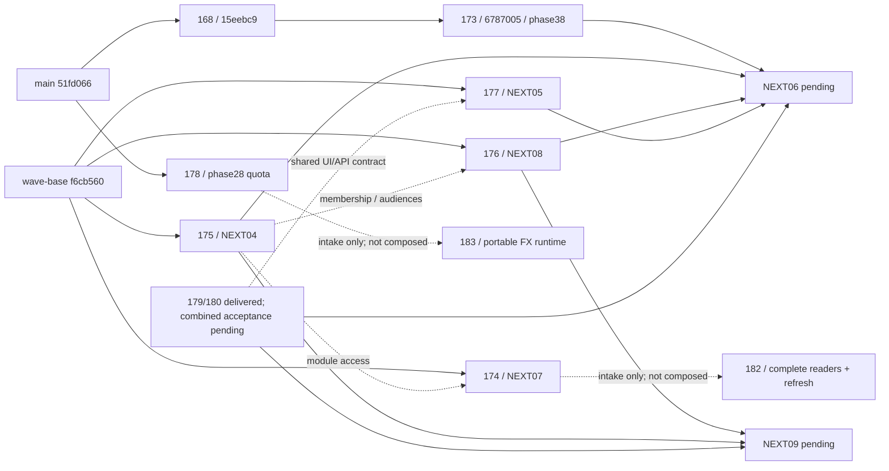

# FOLLOWUP-06 — آمادگی تجمیع و پذیرش مستقل

تاریخ: 2026-10-01، تهران. دامنه: inventory واقعی، ترکیب آزمایشی checkpointهای مشخص، regression، نصب schema و بررسی مستقل Auth/Storage واقعی در دیتابیس ساختگی جدا. **وضعیت: تجمیع نهایی پذیرفته نشده؛ SHA انتشار آماده اعلام نمی‌شود.** بررسی مستقل Auth/Storage همین checkpoint **18 PASS / 2 FAIL / 0 BLOCKED** دارد؛ ورودی Auth تازه و NEXT06 خارج از این checkpoint و گیت‌های انسانی همچنان بازند.

## ادامهٔ جاری — Auth/Storage واقعی روی checkpoint ثابت

برنامهٔ runtime/build/UI همچنان **`2605a0ff11ff5cb0f83837528aed230846469b16`**؛ CI موجود **`b7c77260821cd127c1a7a65eae123022dcf0a43a`**؛ baseline اسناد قبل از این ادامه **`630c4bac8ff264b3f9f27464266e50f239707723`** است. این مرحله application/schema/dependency را تغییر نداد؛ CI پیشین به commit تازهٔ اسناد نسبت داده نمی‌شود. Auth جدید و خانهٔ عضو تازه وارد برنامه نشده‌اند. DEV07@15eebc9 و گیت انسانی آن جدا محفوظ‌اند و دوباره اجرا نشدند.

محیط تازهٔ مجاز **`followup06-auth-storage-2605-local`** روی [ورود واقعی محلی3299](http://127.0.0.1:3299/login?next=%2Fdashboard%2Fholdings)، فقط همین دستگاه؛ checkout منفک `portfolio-followup06-acceptance` روی2605a0f. production build در2026-10-01T10:59:51.399Z موفق شد. سرویس‌های واقعی PostgreSQL17.11، GoTrue2.197.0، PostgREST14.17 و Storage1.11.2 با label اختصاصیfollowup06-accept راه افتادند. Storage نسخهٔ cached واقعی آزموده‌شده است؛ از آن آمادگی نسخه‌های دیگر یا Production نتیجه‌گیری نمی‌شود. هیچ restore یا دادهٔ واقعی وجود ندارد، DB پورت عمومی ندارد؛ APIها فقط loopback، CORS همانorigin204/foreign403 و CSP حاضرند.

[شاهد نصب واقعی](followup-06-auth-storage-evidence/environment.json): Auth و Storage migrationهای native خودشان را اجرا کردند، سپس16 فایل SQL واقعی مخزن از پیش‌نیازها تاphase32→34→35→36→37→38 و migrations04/08 نصب شدند. `sql/test` و policy scaffold استفاده نشدند. [بازتأیید فقط‌خواندنی](followup-06-auth-storage-evidence/environment-verification.json):75 migrationAuth،73 migrationStorage، شش حساب واقعی ساختگی، چهار object واقعاً uploadشده، bucketخصوصیfalse و صفرpolicy deliberately_permissive_test_read. این محیط از DB regression/Storage fixture بخش‌های قبلی جداست؛ نصب روی DB مشترک/لیارا/Production انجام نشد.

[جدول تفصیلی و نقص‌ها](followup-06-auth-storage-evidence/README.md)، [شاهد مقدماتی](followup-06-auth-storage-evidence/acceptance.json): ورود هر شش نقش A/B/expired/cancelled/nonmember/admin از فرم محصول، context تازه، پاسخ nativeAuth و getUser200، بازگشت holdings. اجرای سازنده2026-10-01T11:19:52.952Z→11:21:12.284Z UTC: **17 PASS / 2 FAIL / 0 BLOCKED**. دو دوره، فایل خصوصی واقعی و digestbytes، REST/RPC با JWT واقعاً صادرشده، API04grant/revoke/cancel، API08save/technical approval/ready/publish و حفظ دارایی/بدهی با API173 آزموده شدند؛ نشست تزریق نشد. تأیید فنی پژوهش ساختگی، signoff انسانی DEV07 نیست.

[گزارش مستقل تازه](followup-06-auth-storage-evidence/independent.md)، [شواهد مستقل](followup-06-auth-storage-evidence/independent.json): بازبین جدا `/root/dev07_independent`، با شش login/UI/context تازه و هفتم مهمان، **20 بررسی:18 PASS /2 FAIL /0 BLOCKED**؛ اجرا2026-10-01T11:26:09.668Z→11:27:27.401Z UTC و بررسی مجدد نمایشUIتا11:27:39.154Z. دو نقص04مستقلاً بازتولید شدند. بازبین با adminواقعی یکgrantموقتAرا ازAPIداد وrevokedکرد؛ فایل36بایت باdigestمنطبق، signedTTL60، audienceفقطC1 و ردURLقبلی در65ثانیه400 را مستقل مشاهده کرد. تعداد/hashدارایی/بدهی A/expired/cancelled یکسان وUIآن‌ها پس از renderingواقعی حاضر بود. خواندنtextپیش ازrenderدرتلاش اولیه جدا حفظ و باloginوwaitواقعی راستی‌آزمایی شد؛ FAILمحصولی جدید ازآن فرض نشد. هر16hashفایلSQL وpolicyهایcatalogStorageنیز مستقل تطبیق داده شدند. این بازبین عامل است، انسان نیست؛ گیت‌های انسانی قدیمی بسته نشدند.

پس از revoke، درخواست تازهٔresource403، publication404، nativeStorage400 و RPCfalse شدند؛ دارایی/بدهی شخصی تعداد و SHA256 یکسان داشتند. URLامضاشدهٔ قبلی بلافاصله پس از revoke200 بود، سپس در64ثانیه400 شد؛ URLاول نیز در67ثانیه400 شد. بنابراین capability قبلی حداکثر تاTTL60 قابل استفاده است؛ لغو فوری خودتوکن ادعا نمی‌شود. توکن/URLامضاشده یا اطلاعات ورود ذخیره/تصویر/گزارش نشدند.

دو نقص باز با مالک **NEXT04 / PR175**، پیش از هر اصلاح کد:

| نقص | بازتولید و اثر واقعی | اقدام مالک |
|---|---|---|
|F06-AS-01،P2|مهمان بدونcookie درGETlist/download منابع هر دو503؛ Authسالم200، انتظار401؛ خصوصی افشا نشد|تشخیص AuthSessionMissingError از اختلال واقعی درهر دوhandler، آزمونHTTP و تحویلSHAثابت برایrecheck|
|F06-AS-02،P2|مدیر واقعی بدونentitlement، فهرستC1/C2 هر دو200/یکردیف، downloadهر دو503، nativeStorageهر دو400؛ readpolicyادمین را مجاز می‌کند ولیstorage_allowed بهmodulegrant نیاز دارد|قرارداد مجوز مدیر درفهرست/دانلود/policy یکسان شود؛ اگر منع است403 روشن، اگر مجاز استمسیر مجاز؛ بدونfallbackکلیدservice یا بازکردنRLS؛ تحویلpatchبرایبازآزمایی|

این عامل کد مالک04/08 را تصاحب/اصلاح نکرده است. تلاش اول و خطاهای harness جدا محفوظ‌اند: ledgerمالی مشترک/نام ستون‌هایpositions/receiptUUID ابتدا اشتباه فرض شدند و فقط ابزار پذیرش اصلاح شد؛ [attempt01](followup-06-auth-storage-evidence/acceptance-attempt-01.json) شاهد نقص محصول نهایی محسوب نمی‌شود. cohortلغوشده بازنشانی نشد؛ cohortساختگی تازه برایبازآزمایی ساخته شد. مانع اولیهٔ شبکه داخلیDocker رفع شده و درmanifest سابقه مانده، مانع جاری سرویس نیست. محیط‌های انسانیDEV07/173 و سایرAuthها متوقف/دست‌کاری نشدند؛ فقط DBregression قدیمیِ خوداینمأموریت برایحافظه متوقف وvolumeحفظ شد.

## نسخه و محیط

- main مشاهده‌شده: `51fd0661d48d791ce8758a87828a81ce72cac6df`.
- checkout اختصاصی: `C:/Users/Asus/Documents/ChatGPT/توسعه سایت/portfolio-followup06-integration`، شاخه `codex/followup06-integration-20261001`.
- **SHA ترکیب کد آزموده‌شده: `2605a0ff11ff5cb0f83837528aed230846469b16`.** این SHA فقط checkpoint بررسی است، نه نسخه مجاز انتشار.
- مبنای موج دوم `f6cb560478d51d48dcee2c9b2801eb047f5c7214` شامل main قدیمی و #168@3462f01 بود. آن تاریخچه در ترکیب حفظ شد. اصلاح hash از `a762d853bf690e30f065a6a9f59d57d8951f2bd4` از قبل در ترکیب حاضر بود؛ cherry-pick خالی skip شد.
- محیط DB: container مستقل `liara-budget-test-followup06-20261001`، PostgreSQL 17، بدون پورت عمومی و network=none. هیچ اتصال به Liara/Preview بازیابی‌شده یا Supabase واقعی برقرار نشد.
- محیط build/regression Node 24.19.0؛ CI موجود Node22 و DB16 دارد. اختلاف محیط پنهان نشده است.
- native worktree ابزار app مرجع15eebc9 را در مخزن تحت مدیریت خود پیدا نکرد؛ ایجاد checkout با git در مخزن واقعی پروژه انجام شد. این checkout متعلق به همین مأموریت است. checkoutهای دیگر و sandbox انسانی DEV07 حفظ شدند.

## ورودی‌های تازه179/180 — بررسی فقط‌خواندنی برای مرحلهٔ بعد

پس از تحویل گزارش مستقل18PASS/2FAIL، هماهنگ‌کننده دو نقصF06-AS-01/02را به مالک175 ارجاع داد. **تا تحویلpatchثابت175 وNEXT06، ترکیبruntimeتازه انجام نمی‌شود.** آزمون موفق قبلی تکرار و کد175توسطFOLLOWUP06اصلاح نمی‌شود. sandbox3299، شواهد مستقل و گیت‌های انسانی محفوظ‌اند.

[snapshotفقط‌خواندنی179/180](followup-06-evidence/auth-inputs-179-180.json): metadata/head/base، همه فایل‌ها، هم‌پوشانی، CI سرشاخه و blobاسناد/قرارداد ازGitHubخوانده شدند؛ source رویrefهایimmutableبررسی شد. این کار intakeاست، نهbuild/نصب/پذیرش ترکیبی یا آزمونProduction.

| ورودی | head دقیق جاریِ اینsnapshot | base دقیق | CI همانhead | حد پذیرش |
|---|---|---|---|---|
|[179: fix(auth): bound server login checks and preserve redirect cookies](https://github.com/safariarash7777-source/portfolio-platform/pull/179)|ca27b94a44f9a37785df059574a754e170880aac|main@51fd0661d48d791ce8758a87828a81ce72cac6df|[36854599890](https://github.com/safariarash7777-source/portfolio-platform/actions/runs/36854599890)success|Draft/open/unmerged؛ رفعAuthمالکرویURLاصلی وcorrelationمرورگر/runtime هنوزباز|
|[180: feat(auth): add isolated mobile OTP and transactional email infrastructure](https://github.com/safariarash7777-source/portfolio-platform/pull/180)|bb4f2f3e53859bbecb0ec942975ffb06fd2d2828|wave-review@7cb030c140ce143f03c549125c5e647fea22f44c|[36854583545](https://github.com/safariarash7777-source/portfolio-platform/actions/runs/36854583545) وsandbox36854583557success|Draft/open/unmerged؛ provider/domain/budget/nativeAuthlimits وفعال‌سازی مستقل باز|

179کدappگزارش‌شدهc9ce9e92975d31486518bbb5bd70aec73d6b6ee9دارد؛ diffباheadدرapp/components/lib/middleware/package/schemaخالی است، اما `scripts/testing/auth-owner-sandbox.mjs` نیز تغییر کرده، بنابراین کلdelta راdocs-onlyنمی‌نامیم.180کدappگزارش‌شده05d5ae63f424c556656de2fd267e7ab0d32a4407دارد و deltaپس‌ازآن تاheadخارجdocsخالی است. آزمون‌های صاحباینPRها شاهد همین ترکیب2605نیستند؛ این مرحله خودمان هیچ‌یک راbuild/testنکردیم.

**تفاوت معنایی مهم middleware:** هر دو Node.js، سقف8ثانیه باabort، حفظcookiesredirect و ناوبری کامل ورود را دارند.179 عمداً شرطentitlementsهمانmain را حفظ می‌کند: expires_at>now وبدونفیلترcohort.180 وcheckpoint2605 فعلی `.is('cohort_id',null)` و `activeEntitlementFilter(now)` دارند؛ grantدوره نباید به دسترسی کامل ترمینال تبدیل شود و قراردادnull-expiryنیز جداست. ترکیب آینده باید deadline/cookie/runtimeP0را با قرارداد دسترسی جاری حفظ کند؛ کپی کاملmiddleware179 رویwave بدون بررسی مجوزها مجاز نیست. این اختلاف ثبت شد، حل/ترکیب/تست نشده است. هم‌پوشانی کاملlogin/loginFlow/middlewareوartifactهایAuthدرJSONثبت است؛ هم‌پوشانی فایل الزاماًconflictGitنیست.

[قراردادAuthv1 درhead180](https://github.com/safariarash7777-source/portfolio-platform/blob/bb4f2f3e53859bbecb0ec942975ffb06fd2d2828/docs/ops/seasonal-program/AUTH-API-CONTRACT-v1.md): UUIDهمانauth.users.id، roleازprofiles.role، sessionازcookiescanonical؛ statusبرایUIمجوزنیست. loginemail/passwordوPKCEحفظ؛ mobileخاموش‌پیش‌فرض، شمارهتأییدشده/پروفایل خصوصی ازmembership/رضایت مشاور مستقل‌اند. identityMatch وphoneNationalIdMatchهمیشهpending؛409پروفایل بایدورودیرا حفظ وGETتازه/حل‌تعارض داشته باشد. APIهایstatus/session/mobile/identity/emailوadmin/auth-health فقطبعدنصب/پیکربندی همان نسخه مصرف شوند؛ پاسخ503/غیرفعال را نبایدبا«تکمیل هویت»یا«عضویت»پنهان کرد. پایانعضویت دادهشخصی را حذف نمی‌کند. NEXT05پوسته وNEXT06فرم‌مصرف‌کننده‌اند؛ NEXT09Telegramchallengeمستقل دارد واینAPIپیام/لینکTelegramنمی‌سازد.

migration180 `20261001083215_auth_private_identity_versions.sql` افزایشی بهUUIDموجود است؛ درsandboxپذیرشFOLLOWUP06یاDBمشترک نصب نشده. serviceSMSباامضا/ledger وemailtemplates/nativeSMTP، HMACrotation/reindex، MFA/SIMrecovery وingress/native limits ورودی‌ها وگیت‌های صاحب180هستند؛ ازCIسبز، آمادگیproviderیاارسالواقعی استنتاج نمی‌شود. گزارش‌هایصاحب179/180، Previewهای خودکارِ قبلی را باbundleقدیمیcloudSupabase ثبتکرده‌اند؛ صحتorigin/زوجpublicLiaraenv/SSR/callbackهرPreviewتازه پیش‌نیازآزمونهمانمحیط است، نه علتقطعی حادثهProduction. هیچenvخارجی/کلید/حساب/شماره/رمز تغییر نکرد.

## inventory سرشاخه‌ها

### ورودی‌های تازه182/183 — فقطinventory؛ خارجruntimeجاری

[snapshotبازخوانیGitHub/CI/قرارداد](followup-06-evidence/market-fx-inputs-182-183.json) شاملhead/base، فایل‌ها، پنجjob هرCI وblob اسنادِ همانref است. گزارش182 در مسیر محلی تحویل‌شده نیز خوانده شد و سندrefimmutable182 مبنای ارجاع است. هیچ build/test/merge/retarget/install/deploy تازه انجام نشد؛ موفقیت قبلی2605 تکرار نشد و شواهد18PASS/2FAIL محفوظ‌اند. **ترکیبruntime بعد ازpatchثابت175 و تحویلNEXT06 می‌ماند. FOLLOWUP03 به مالک لیارا واگذار شده و هنوز ورودیترکیب نیست.**

| ورودی | head دقیق | base دقیق | CI مشاهده‌شده رویهمینhead | حد ادعا |
|---|---|---|---|---|
|[182: fix(market): complete paginated readers and five-minute board refresh](https://github.com/safariarash7777-source/portfolio-platform/pull/182)|e5740be93f666dc76a605ccef190f710767ab748|174@95cfa3410a97ac0d98cdefcb6671d4cfcb668646|[36855945325](https://github.com/safariarash7777-source/portfolio-platform/actions/runs/36855945325):هرپنجjobموفق|Draft/open/unmerged؛ دوچرخهٔزندهBLOCKED|
|[183: Verify portable FX dashboard runtime and document Linux acceptance](https://github.com/safariarash7777-source/portfolio-platform/pull/183)|8723c55766e456c0b519b4ead3c301440b4ff05f|178@4ce06b3ffbd6b50125021faeb454fbf11c73b900|[36857415272](https://github.com/safariarash7777-source/portfolio-platform/actions/runs/36857415272):هرپنجjobموفق؛ وضعیتقبلاًنامعلوم اکنونمستقیماًتأییدشد|Draft/open/unmerged؛ runtimeآزموده‌شدهbce2e9e86a21c474742d0bedb76163f753fd7a00؛ headپس‌ازآن چهارفایلdocs/evidenceفقط|

182 پساز174، قراردادواحد/null/NAV/مجوز آنرا حفظ می‌کند و quota178را واردنمی‌کند. گزارشصاحب182 implementatione6ed01702e17e21500a5cf45f7507ef83f2dfa7f وfixtureهایPostgREST/مرورگر را جدا ازhead/CIنهایی ثبت کرده؛ این intakeآنآزمون‌ها را اجرا نکرده و بهruntime2605نسبت نمی‌دهد. readerها keyset/fence، نتایج وcacheفقطکامل، coverageتهی/stale/error و تقدمcaptured_at/idاصلاحیه دارند؛ getHistorySymbolsRead همچنان30روز است، نههمهتاریخچه. cache/single-flight درهرprocess وبدونضمانتMVCCیاپایداریcross-instance؛ refreshپنج‌دقیقه ازهمانrouter.refresh، hiddenpause، leaseتاackرندرسِرور، حفظlast-valid/filter/sort/scroll. نبودacktransport بعدخطا نیازبهnavigation/reloadدارد. اسکنکامل درخواستDBبیشتر ازخواندنصفحهٔاول دارد؛ بودجه/latencyزندهاندازه‌گیری‌شده نیست.

گیت182: quota178بایدباbaseline/resetمشترک معلوم درreleaseمصوب نصبشود و بعد دوچرخهٔliveهماننسخه اجرا شوند؛ فعلاًBLOCKED. bulkReturns/avgVolume/large-history-export، raceتعویض‌سریعURL وp95 خارجادعایاینPRاند. مالکreader/refresh182 کد وcoverageرا تحویل داده؛ upstream/quota/install/refreshsharedوFOLLOWUP03با لیارا می‌مانند. FOLLOWUP03در بهینه‌سازی aggregation/cache/progressive render نبایدcoverageیاکامل‌بودنread را حذف کند. package.json182 wiringتستفقط دارد؛ درترکیبآیندهunionآن باscriptsقبلی/179/180 لازم است؛ فعلاًکپی/ترکیب نشده.

183 باbase178، diff110فایلش واقعاً فقط `scripts/fx-maintenance/` و `docs/ops/fx-maintenance/` است؛ تغییرwrapperمرکزی، quotaimplementation، فرمول، Hermesjob/cadence/volume/configفعّال دراین تحویل ادعا/اجرا نشده است. compareGitHub ازruntimebce2e9e بهhead8723c55 دقیقاًیکcommit/چهارفایلdocs/evidence دارد. شواهدصاحببسته ازruntimeیکسانWindows/Linux،105hashmanifest، AppTest/Streamlitایزوله وreceipt/outagefixture محفوظ‌اند؛ CIپنجjobمخزن پذیرشPythonruntimeیاپذیرشمالی/زنده را جایگزین نمی‌کند و intakeتستruntimeرا تکرار نکرد.

[قراردادفرانت183](https://github.com/safariarash7777-source/portfolio-platform/blob/8723c55766e456c0b519b4ead3c301440b4ff05f/docs/ops/fx-maintenance/FRONTEND-CONTRACT.md): نتیجهفرآیند/سلامتمنبع/کامل‌بودنداده سه محور مستقل؛ receiptبایدhashbytes/run_id/readbackزمان داشته باشد، publicationtime≠dataobservation؛ iframe.onloadمعنیAuth/۱۲تبسالم ندارد. مالکمدل/Hermes/تعاریفFX باچتارز؛ quotaوsharedinstallation با لیارا/178؛ wrapper وپذیرشمدیرواقعی `/admin/fx` بامالکورود/محصول `01a0f31c-bc6d-7af3-8194-fd2ad178119e` است. cadenceپنج‌روزهٔWindowsموجود حفظ، انتقالHermesبهLinuxمأموریتاین بسته نیست. dependencies/constraintsفقطنسخه‌های مشاهده‌شده‌اند، lockکاملtransitiveنیستند؛ اینintakedependencyنصب نکرد.

گیت183: D-FX/روشمالی، تاریخچهٔماهانهٔYTMهم‌تعریف، تازگیبازار، سهمیهٔواقعی/reset، transportانتشارزنده ومرورگر/mobile/fullscreen/download باadminواقعی بازند. انتشارfixtureمحلی simulated است؛ readbackآرشیوآزمایشی به‌معنی انتشارSFTPسرویسزنده نیست. rawworkbookها/fixturearchive/runtimearchive/credentials خارجGitمی‌مانند؛ هیچhook/job/providerاختیاری فعال نشد. اینCIمشخص‌شدهرویhead183، CIترکیبفعلییامجوزmerge/deploy نیست.

اطلاعات GitHub و `git ls-remote` واقعاً خوانده شدند؛ SHA کامل، base و merge-base، فایل‌ها، scripts و hashها در [inventory اولیه](followup-06-evidence/inventory.json) ثبت‌اند. جدول زیر snapshotاول قبلتحویل179/180است؛ intakeجدیدبخشبالامرجعAuthتحویل‌شده است. همه هفت PR هنگام بررسی Draft/Open بودند؛ هیچ‌یک retarget یا merge نشد.

| بسته | PR | head دقیق | base جاری | وضعیت ورودی |
|---|---|---|---|---|
| دارایی/مشاوره DEV07 |168|15eebc97ca650dde5f2687e36d9d98d193d0d543|main@51fd066|تأیید انسانی سناریوی۵ باز؛13/0/1 متعلق به همین SHA|
| ترازنامه |173|6787005ad7b65acc49a059c2f9035ab16eb306f2|168@15eebc9|کد runtime گزارش‌شده56deb8c85a2a09009d1624cd07b78ea87535ab2a؛ تحویل بعدی docs-only؛ فهم انسانی باز|
| بازار NEXT07 |174|95cfa3410a97ac0d98cdefcb6671d4cfcb668646|wave-base@f6cb560|checkpoint فنی؛ تازگی upstream/استقرار نهایی باز|
| عضویت NEXT04 |175|bb7c2f9f89ea48929b6fd13a9dc9b16d58efa8a6|wave-base@f6cb560|Auth/Storage واقعی و شرایط تجاری باز|
| میز پژوهش NEXT08 |176|d69763563ef695b2d16ea2e52be4a4452b0811dc|wave-base@f6cb560|پذیرش مقصد با هویت واقعی باز|
| فرانت NEXT05 |177|27e59ad8d85f37da32b6f5346d289afdb73b20e6|wave-base@f6cb560|طراحی/فونت و مصرف قرارداد Auth با مالک اصلی|
| سهمیه FOLLOWUP02 |178|4ce06b3ffbd6b50125021faeb454fbf11c73b900|main@51fd066|baseline مصرف و پنجره reset واقعی نامعلوم؛ NOT DEPLOYED|
| Auth FOLLOWUP01/07 |—|checkpoint محلی7cb030c140ce143f03c549125c5e647fea22f44c|ترکیب موج دوم|تغییرات Auth ثبت‌نشده و فعال؛ کد تازه وارد ترکیب نشده|
| خانه عضو NEXT06 |درحال ساخت|ورودی پایدار نهایی تحویل نشده|173 + API04 + پوسته05 + انتشار08 + Auth|مالک عملکرد چت173؛ پذیرش PENDING|

snapshotاول از تغییراتAuth فقط شامل نامفایل‌ها وcheckpointبود؛ تغییرات درحال ویرایش کپی/commit/آزموده نشدند. اکنون مالک179/180وSHAثابت وقراردادAPI/UI را تحویل داده؛ intakeبالا صرفاًخوانده و ثبت شد، runtimeترکیب نشده است. ایمیل طبقDD033حفظ؛ SMSتولیدپیش‌فرض خاموش است. فرم تماس177 فعلاًایمیلی است؛ تغییرموبایلی پسازقراردادbackendتوسطمالکاصلی می‌ماند.

## نقشه وابستگی و ترتیب امن

ترکیب انجام‌شده در شاخه اختصاصی: 168 →173 →175 →174 →176 →177 →178؛ dependencyهای منطقی04 قبل از مصرف‌کنندگانش نگه داشته شدند. مرحله Auth/NEXT06/NEXT09 فقط پس از checkpoint ثابت، قرارداد و مالکیت مشخص افزوده شود؛ سپس CI و regression مسیرهای متأثر روی همان SHA انجام شود. قرارداد مدل ارز با مجری ارز، داده/refresh با چت لیارا و مدل مالی173 با صاحب آن می‌ماند. این گزارش آن قراردادها را بازطراحی نکرد.

## برخوردها و مالک رفع

[file overlaps](followup-06-evidence/inventory.json) هم‌پوشانی فایل است؛ همه آنها conflict واقعی نیستند. [ثبت ترکیب](followup-06-evidence/composition.json) برخوردهای مشاهده‌شده را جدا نگه می‌دارد.

| برخورد | مشاهده/اقدام این مأموریت | مالک ادامه |
|---|---|---|
| package.json در175،174،176،178 |union فایل‌های core/DB و کلیدهای scripts؛ test:public حفظ؛ NAV و دو suite بودجه در relay حفظ؛ dependency/lockfile یکسان|FOLLOWUP06؛ افزودن tests تازه با مالک هر بسته|
| COMMAND-CENTER در175 و178 |هر دو بخش منبع حفظ شد؛ اسناد قدیمی شاهد پذیرش SHA تازه تلقی نمی‌شوند|هماهنگ‌کننده برای وضعیت مرکزی جاری|
| merge-base مجازی package در175 |base داخلی Git خود marker داشت؛ مقایسه با checkpoint صریحf6cb560 و union؛ هیچ آزمون حذف نشد|FOLLOWUP06؛ در تجمیع نهایی دوباره بر SHA واقعی|
| relay/server.mjs و eod.test بین174/178 |Git بدون conflict متنی ترکیب کرد؛ diff معنایی و suiteهای NAV/بودجه/رله بررسی شدند|لیارا برای quota/refresh؛ مالک174 برای نما؛ FOLLOWUP06 برای ترکیب|
| phase37 →phase38 |نام فایل متفاوت؛ جایگزینی عمدی RPC مالی و قرارداد نسخه/PT409؛69 regression مرتبط موفق|مالک173؛ FOLLOWUP06 هنگام تغییر base|
| migrations04 →08 |timestamp متفاوت و namespaceهای افزایشی؛ هر دو در schema ترکیبی نصب شدند|مالک04/08؛ FOLLOWUP06 نصب ایزوله|
| Auth: middleware، returnPath/loginFlow، package، workflow و صفحات ورود |تغییرات فعال و ثبت‌نشده؛ وارد ترکیب نشدند|مجری Auth؛ FOLLOWUP06 پس از head ثابت|
| globals/Navbar/Footer و فونت، خانه عضو |پیاده‌سازی موازی انجام نشد|طراحی با چت ورود؛ عملکرد خانه عضو با چت173|
| build.txt تاریخی177 |whitespace موجود در شاهد قدیمی حفظ شد؛ source diff-check جدا انجام شد|شاهد تاریخی تغییر نمی‌کند؛ defect محصول نیست|

## migrationها و شاهد نصب

[شاهد نصب کامل](followup-06-evidence/schema-installation.json): **15 مرحله موفق،35 جدول public**؛ داده‌های authUsers/holdingVersions/courses/researchVersions همگی صفر. این نصب روی DB ساختگی این مأموریت است؛ Auth و Storage آن از test scaffold هستند، نه سرویس واقعی.

ترتیب اجرا:
1. `sql/test/supabase_bootstrap.sql` + profile explicit + پیش‌نیاز ساختگی تماس/payments/audit/Storage از آزمون04 + `portfolio_precondition.sql`.
2. `phase8_webinars →phase11_access_tiers →phase27_member_import`.
3. `phase32 →phase34 →phase35 →phase36 →phase37 →phase38`.
4. `20260930182629_seasonal_course_membership →20260930182918_research_publication_queue`.
5. نسخه سخت‌گیرانه `phase28_brsapi_budget` از178؛ این مسیر از مالی مستقل است و پیش از فعال‌کردن consumer واقعی نیاز به baseline تأییدشده دارد.

Hash هر فایل در inventory برای Git/LF و در نصب برای **bytes واقعاً اجراشده** ثبت است. فایل‌های قدیمی sql در checkout ویندوز CRLF دارند؛ hash bytes آنها با Git/LF متفاوت است ولی محتوای نرمال‌شده برابر است. timestamp04/08 طبقa762d85 LF ثابت دارند:
- 04: `509a6a8c17d47e26bd4adfbe438e02f80b6da225da778b0f124825bfe4f9e71b`
- 08: `c72828b50e66843d594c6be710f6ba813fb7ff8e7591581f6f4e2c1ecc1f5229`

تلاش اول ابزار نصب به محدودیت طول command در ویندوز برخورد کرد؛ **خطای حمل SQL، نه migration محصول**. [شاهد تلاش](followup-06-evidence/schema-installation-transport-attempt.json) نگه داشته شد. ارسال فایل از stdin و بازسازی صرفاً DB اختصاصی این مأموریت، نصب کامل را موفق کرد. هیچ migration مشترک اجرا نشد؛ وضعیت نصب Liara از این شاهد استنتاج نمی‌شود. Storage scaffold عمداً policy آزمون دارد و جای پذیرش provider خصوصی واقعی نیست.

## آزمون‌ها و CI

[نتیجه و hash لاگ‌ها](followup-06-evidence/checks-summary.json)، [کنترل union scripts](followup-06-evidence/scripts-union.json)، [CI مستقیم سرشاخه‌های ورودی](followup-06-evidence/source-ci.json).

روی SHA ترکیبی2605a0f:
- core1239، calc106، public57: PASS، صفر fail/skip.
- DB مالی/مشاوره69، عضویت22، انتشار22، سهمیه14: **127 PASS / 0 FAIL / 0 SKIP**.
- هر20 فرمان suiteهای relay موفق؛ بعضی runnerهای قدیمی فقط exit-code می‌دهند، برای آنها شمار آزمون اختراع نشده است.
- typecheck، lint با صفر warning و build موفق. validate:sql:49 فایل، صفر مردود.
- آزمون HTTP/DB از handler واقعی و PostgreSQL استفاده می‌کند؛ هویت handler در این regressionها مصنوعی است. **این اجرا ورود واقعی ترکیبی یا پذیرش مستقل انسانی نیست.**
- تست backup/restore محلی دوباره اجرا نشد. CI استاندارد مخزن آزمون‌های عادی خود، از جمله fixtureهای کاملاً مصنوعی خودش، را اجرا کرد؛ هیچ بکاپ/بازیابی واقعی انجام نشد.
- خطای اولیه runner کیفیت فقط مسیر اشتباه فهرست public بود؛ از script واقعیtest:public استفاده و همان بخش/چک‌های باقی اجرا شد. core/calc موفق بی‌دلیل تکرار نشدند.
- لاگ‌های خام در پوشه پروژه موجودند؛ نتیجه/تاریخ/hash و شاهدهای خلاصه نسخه کنترل‌شده‌اند. آنها حاوی داده واقعی مشتری یا اطلاعات ورود نیستند.

CI تمام هفت head ورودی مستقیماً از GitHub **success** مشاهده شد؛ شماره اجراها:168=36840882933،173=36845293824،174=36771898821،175=36775201105 و sandbox36775201175،176=36774747309،177=36774588464،178=36843617522. این CIها به SHAهای ردیف inventory تعلق دارند؛ نتیجه آنها CI ترکیب2605a0f نیست. **CI ترکیب نیز SUCCESS است**: [run36848183098](https://github.com/safariarash7777-source/portfolio-platform/actions/runs/36848183098) روی checkpoint `b7c77260821cd127c1a7a65eae123022dcf0a43a`؛ workflow_dispatch، هر5job موفق. CI اصلی DB425/0/0 در37suite و بودجه13/0/0 را اجرا کرد؛ locally بودجه14 شامل stop/start container اختصاصی بود. [وضعیت/steps](followup-06-evidence/integration-ci.json) و [خلاصه مستقیم لاگ jobها](followup-06-evidence/integration-ci-log-proof.json) ثبت شدند. تفاوت این checkpoint با کد آزموده‌شده2605a0f فقط اسناد و سه ابزار FOLLOWUP06 testing است؛ application/schema/dependency تغییر ندارد. commit نهایی ثبت نتیجه CI فقط docs است و CI این checkpoint را به head جدید نسبت نمی‌دهد.

## ماتریس ساخته / آزموده / نصب / منتشر / پذیرفته

«نصب» این جدول فقط sandbox این مأموریت است. در این مأموریت استقرار برنامه یا تغییر schema محیط مشترک/Production انجام نشد.

| بخش | ساخته/ترکیب | آزموده | نصب ایزوله | منتشر در محیط کاربر | پذیرفته نهایی |
|---|---|---|---|---|---|
|168|کد ثابت15eebc9 و checkpoint ترکیب|DEV07 قبلی13/0/1؛ regression69 مرتبط جدید|32…37 حاضر|در این مأموریت خیر|BLOCKED تأیید انسانی۵|
|173|6787005 ثابت|regression مالی/مجوز؛ runtime قبلی56deb8c در گزارش173|phase38 حاضر|خیر|فهم مشتری واقعی و تجمیع PENDING|
|175|bb7c2f9 ثابت|22 DB/HTTP قبلی؛ realAuth/Storage مستقل18PASS/2FAIL|timestamp04 درDBregression وsandboxnativeجدا؛ privatebucket/objectواقعی|خیر|FAIL دو نقص مستقلF06-AS-01/02؛ patchمالک04وrecheckلازم|
|174|95cfa34 ثابت|core/relay/build ترکیب|schema تازه مستقل ندارد|خیر|تازگی/پوشش داده زنده PENDING|
|176|d697635 ثابت|22 DB/HTTP قبلی؛ API08باadminAuthواقعی؛ مخاطبC1/منعC2مستقلاًتأییدشد|timestamp08 درهر دوsandboxجدا|خیر|مخاطب/currentcheckpointموفق؛ گیت‌های کل ترکیب باز|
|177|27e59ad ثابت|57 public/build و قراردادهای موجود|schema مستقل ندارد|خیر|Auth جدید و طراحی/فونت مالک PENDING|
|178|4ce06b3 ثابت|14 DB + suiteهای relay|phase28 حاضر فقط اینجا|NOT DEPLOYED|baseline مصرف/reset واقعی BLOCKED|
|Auth|179/180تحویل‌شده؛ بیرونcheckpoint2605|اینمرحلهفقطintake؛ CIخودheadهاسبز؛ درترکیبآزموده‌نشد|migration180دراینsandboxنصب‌نشد|آزمونارسال/پیکربندیواقعی مستقل باز|PENDING ترکیب/پذیرش؛ head/قرارداداکنونمشخص|
|NEXT06/09|در حال ساخت/وابسته؛ وارد checkpoint نشده|آزموده‌شده اعلام نشد|نصب نشد|خیر|PENDING|
|کل ترکیب|2605a0f قابل بررسی|build و regression بالا|schema ترکیبی35 جدول|خیر|NOT ACCEPTED؛ SHA انتشار نداریم|

## ثبت پایدار DEV07 و تفاوت SHA

گزارش DEV07 قبلاً فقط محلی بود. شش فایل گزارش/شاهد/پژوهش و به‌روزرسانی‌های عملیاتی آن، بدون تغییر application/schema، در commit مستقل **`2d7f4a9d0ca2fa9fac5d5af49f9c654c3135e266`** روی شاخه این مأموریت ثبت شدند. `git diff 15eebc9 2d7f4a9 -- . ':!docs'` خالی است. head PR168 عوض نشد.

- SHA آزمون واقعی DEV07: `15eebc97ca650dde5f2687e36d9d98d193d0d543`.
- SHA docs-only ثبت شواهد: `2d7f4a9d0ca2fa9fac5d5af49f9c654c3135e266`.
- [گزارش frozen DEV07](../DEV07-FINAL-15EEBC9.md)، [شواهد](../DEV07-EVIDENCE-15EEBC9.json)، [پژوهش ساختگی ذخیره‌شده](../../research/DEV07-SYNTHETIC-RESEARCH-15EEBC9.json).
- خودآزمایی تازه به پذیرش قبلی نسبت داده نشده؛۱۴ سناریوی موفق بدون دلیل تکرار نشدند. CI سبز یا regression حاضر گیت انسانی را نمی‌بندد.
- sandbox آرش و کاربرگ `802d41ba-7194-4971-b6fc-f696cae2b0e8` نسخه۱ دست‌نخورده‌اند. دستور اقدام انسانی و مسیر امن حساب در همان گزارش DEV07 است؛ رمز/توکن اینجا نیست.
- ابزار آزمون در commit `5eb96d4cb83aa3f49d0b1d701109584679deca76` ثبت شد؛ تغییر application/schema نسبت به2605a0f فقط در scripts/testing است، نه مسیر محصول. commitهای بعدی اسناد این بسته شاهد تازه UI/Auth محسوب نمی‌شوند؛ SHA برنامه آزموده‌شده صریحاً2605a0f باقی است.

## موانع و اقدام بعدی

| مانع | اقدام لازم | مسئول |
|---|---|---|
|DEV07 سناریوی۵ انسانی|بررسی منبع/نسخه کاربرگ و تأیید داخلی از UI واقعی؛ ثبت هویت و زمان|آرش/بازبین انسانی مستقل|
|173 فهم مشتری|ارزیابی فهم خلاصه ناقص/خالص منفی با مشتری مناسب؛ شاهد انسانی جدا|صاحب173 و مشتری|
|Auth179/180 تحویل‌شده؛ ترکیب و ورودمالک باز|headثابت/قرارداد intakeشد؛ پسpatch175وNEXT06 تطبیقmiddleware/مجوز، نصبsandboxمصوب وCI/پذیرشهمانSHA؛ AUTH00رویURLاصلیشاهدجدا|مجریAuth/زیرساخت؛ FOLLOWUP06درمرحلهبعد|
|NEXT06 و NEXT09|تحویل مستقل با SHA و fixture/قرارداد فعلی؛ بدون مدل مالی/Auth موازی|مجری173 برای06؛ صاحب09|
|داده/refresh/quota178|تثبیت baseline مصرف و reset، نصب مصوب، خواندن کامل/تازگی واقعی؛ consumer با baseline UNKNOWN خاموش بماند|چت لیارا؛ قرارداد مدل با ارز|
|Auth/Storage/publication تجمیع|مرحله واقعی همینcheckpointاجراشد؛ دو نقص مهمان/مدیر بامالک04باز؛ patchثابت وبازآزمایی مستقل متأثر لازم؛ ورودیAuthجدید/NEXT06هنوزجدا|مالکNEXT04برایاصلاح؛ FOLLOWUP06برایrecheck؛ بازبین مستقل موجود|
|CI و release gates|CI checkpoint حاضر سبز است؛ پس از Auth/NEXT06/09، CI همان SHA تازه و regression متأثر، بررسی DD034/035/036 و HOLD پرداخت؛ سپس تصمیم ادغام|FOLLOWUP06 و هماهنگ‌کننده|

تغییر/retarget PRهای دیگر، merge بهmain، انتشار Production، نصب مشترک، فرانت/فونت موازی و ارسال پیام/اعلان واقعی انجام نشد. checkout مرکزی و docs/README مرکزی ویرایش نشدند؛ تغییرات inherited اسناد در ترکیب از commitهای ورودی‌اند.

## ابزار و مهارت واقعاً استفاده‌شده

GitHub connector و Git برای inventory/CI/refهای واقعی؛ git worktree جدا و git merge آزمایشی فقط روی شاخه اختصاصی؛ Node test/Next/ESLint/TypeScript و Docker PostgreSQL برای شواهد. runtime بسته موجود از ابزار load_workspace_dependencies معرفی شد؛ dependency جدید نصب نشد، node_modules همان lock موجود بازاستفاده شد.

مهارت‌های `using-git-worktrees` و `verification-before-completion` از `C:/Users/Asus/.claude/skills` خوانده/اعمال شدند: تشخیص checkout/ابزار native، fallback پس از خطای واقعی و تطبیق exit-code/نسخه پیش از ادعا. مهارت Supabase و changelog ثبت‌شده همین روز برای تفکیک grants/RLS، Auth واقعی از scaffold و منع ادعای نصب محیط مشترک استفاده شد. اسکیل `.claude/skills/iran-market-data/SKILL.md` و کاتالوگ رسمی داخلیbrsapi برای مصرف صفر upstream، null/تازگی/واحد و سهمیه خوانده شدند. receiving-code-review از مأموریت پیشین در این نوبت دوباره اجرا/ادعا نشده؛ UI/فونت یا provider تازه ساخته نشد.

منابع واگذاری مرکزی: FOLLOWUP-06-INTEGRATION، README، CLAUDE، COMMAND-CENTER، AUTH-MOBILE-IMPLEMENTATION، FOLLOWUP-07-SMS، NEXT-06-ACTIVATION-20261001 و DOCUMENTATION-POLICY-20261001 در checkout `portfolio-product-direction`؛ این‌ها دستور/قرارداد هستند، نه شاهد نصب یا پذیرش.

## تحویل نسخه کنترل‌شده

شاخه اختصاصی `codex/followup06-integration-20261001` به origin push شد؛ PR جدید ایجاد و PRهای ورودی تغییر نکردند. گزارش DEV07 و تمام JSONهای شاهد این بسته نسخه کنترل‌شده‌اند. لاگ خام محلی است و hash/خلاصه مشاهده‌شده آن در JSONها ثبت است. [نسخه گزارش روی شاخه اختصاصی](https://github.com/safariarash7777-source/portfolio-platform/blob/codex/followup06-integration-20261001/docs/ops/seasonal-program/FOLLOWUP-06-RESULT.md). ثبت نتیجه CI بعد از b7c7726 فقط docs-only است؛ نتیجه UI/Auth تازه‌ای از آن استنتاج نشده. برای dispatch CI از [endpoint رسمی GitHub](https://docs.github.com/en/rest/actions/workflows#create-a-workflow-dispatch-event) و credential موجود مخزن فقط در حافظه فرایند استفاده شد؛ credential/token ذخیره یا نمایش داده نشد. بازیابی وضعیت از connector فقط PR-event را می‌دید؛ نتیجه workflow_dispatch با API و سپس لاگ jobهای connector تطبیق داده شد.
