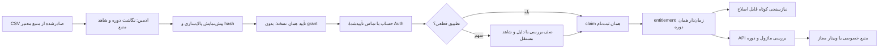

# NEXT-04 — هستهٔ دوره، ثبت‌نام و دسترسی

تاریخ بررسی: ۳۰ سپتامبر ۲۰۲۶، Asia/Tehran. تحویل در checkout ایزوله؛ هیچ migration، policy تجاری، پرداخت یا ارسال به عضو واقعی در Production اجرا نشده است.

کد تحویلی: `0dcfd1d5332160eb09ab0e0a37fa5728d022916a`؛ [PR175 ـ Draft](https://github.com/safariarash7777-source/portfolio-platform/pull/175)، base=`codex/wave-02-base-20260930@f6cb560`. نهایی‌سازی گزارش در آغاز۱اکتبر تهران؛ تاریخ آزمون‌ها در log حفظ شده است.

## مبنا و وضعیت

README مشترک، WAVE-02-REVIEW و قرارداد/ممیزی‌های NEXT-01/02/03 مبنا هستند. refs تازه: main=`51fd0661d48d791ce8758a87828a81ce72cac6df`؛ #168=`3462f0178ebed6b7a9966b465ba0756119ce267a`؛ #113=`b64ec25ec4b812d563ff0eea9935734dfed56e60`؛ #156=`fbb627e3a0560d3087f258ca165617859a990db6`. baseline ترکیبی `f6cb560` است: #168 + main، با حفظ تنظیمات Liara main. branch: `codex/next-04-core-20260930`؛ PR به branch بازبینی `codex/wave-02-base-20260930` می‌رود و وابستگی #168 را حذف نمی‌کند.

**ساخته شده:** import CSV پیش‌نمایش/تأیید، claim با هویت تأییدشدهٔ حساب، ledger دوره در entitlements موجود، نیازسنجی نسخه‌دار، مجوز ماژول سمت DB/API، عملیات دلیل‌دار، فایل خصوصی و قرارداد نسخه‌دار برای 06/07/09.

**مشروط:** انتخاب نهایی D-034، پرداخت D-024، اتصال شریک ناشناخته، Auth/Storage واقعی محیط Liara، نصب migration در محیط هدف و UI اصلی عضو NEXT-06. API رسمی شریک یا webhook عمومی ساختگی ایجاد نشده است. مسیر کسب‌وکار تجاری پیش‌فرض بسته است.

## جریان و مالکیت داده

تماس واردشده در فرم/profile، پرداخت، نقش registered و رضایت مشاوره هیچ‌کدام به تنهایی مالکیت ثبت‌نام نیستند. claim فقط تماس تأییدشده در `auth.users` را با receipt معتبر تطبیق می‌دهد؛ userId ارسالی کاربر رد می‌شود. تطبیق چند حساب به صف بررسی می‌رود. انتخاب حساب در ابزار ادمین همراه دلیل حداقل ۲۰ کاراکتر برای شاهد مستقل است؛ تماس آن حساب همچنان باید تأیید و برابر receipt باشد. ادمین نمی‌تواند receipt قبلاً claimed را به حساب دیگر منتقل کند.

| مفهوم | پیاده‌سازی و مرجع موجود | حد |
|---|---|---|
| حساب | auth.users + profiles موجود | مدل user موازی ندارد |
| course/cohort | courses / course_cohorts در migration جدید | دوره واحد خدمت؛ policy و window صریح |
| webinar | webinars موجود + cohort_id | رویداد داخل دوره؛ URL در پاسخ عمومی نیست |
| registration | phase27 member_import_batches/rows توسعه یافته؛ webinar_registrations موجود | source + external ID؛ receipt از grant جدا |
| account-link | وضعیت claim/identity_evidence روی receipt | تماس تأییدشده، بررسی ابهام و audit |
| membership/module-grant | entitlements موجود + cohort_id/module_keys؛ member_grants به همان ledger اشاره دارد | هیچ grant موازی؛ دورهٔ دیگر private content را باز نمی‌کند |
| نیازسنجی | needs_assessment_versions | چهار فیلد آموزشی، append-only نسخه، optimistic concurrency |
| منبع | course_resources، bucket خصوصی course-private | متن عمومی از فایل/لینک خصوصی جدا |
| تاریخچه | seasonal_events + دلیل عملیات | grant/revoke/renew/import/cancel قابل ردیابی |
| publication | مالک NEXT-08 | قرارداد مشترک، پیام‌رسانی مالک NEXT-09 |

`fn_user_access` و helperهای legacy، grantهای cohort را در full عمومی حساب نمی‌کنند. helper فیلتر entitlement از قرارداد موجود #113/#156 بازاستفاده شده؛ NULL برای پایان legacy دائمی قابل قبول است، برای cohort ممنوع است. wrapper مسیرهای legacy phase27 و ثبت‌نام وبینار حفظ شده، ولی grant دوره را نمی‌توان با آن‌ها به دسترسی سراسری تبدیل کرد. پرداخت Production و بسته‌های باز #113/#156 ادغام یا فعال نشده‌اند.

## سیاست زمان؛ D-034 همچنان OPEN

انتخاب آزمایشی باید صریح باشد: `gregorian-calendar-months/3` یا `fixed-days/90`، start با زمان تهران، policyVersion و `commercialEnabled:false`. ایجاد دوره تنها draft می‌سازد. نبود policy معتبر خطاست؛ default ضمنی سه ماه وجود ندارد. تقویم جلالی در محاسبه ادعا نشده است؛ UI زمان را تهران نشان می‌دهد، پیشنهاد تقویم میلادیِ ماه‌به‌ماه همچنان نیازمند تصمیم مالک است.

| مرز | نمونهٔ دقیق و رفتار |
|---|---|
| شروع | 2026-10-01 09:00 تهران = 2026-10-01T05:30Z؛ همان لحظه مجاز |
| سه ماه میلادی | پایان 2027-01-01 09:00 تهران = 05:30Z؛ همان لحظه دیگر مجاز نیست |
| ۹۰ روز | پایان 2026-12-30 09:00 تهران؛ با سه ماه بالا دو روز اختلاف دارد |
| انتهای ماه | 2027-01-31 09:00 +۳ ماه = 2027-04-30 09:00 تهران؛ clamp آخر ماه |
| دیرهنگام | receipt در 2026-10-20 09:00؛ شروع grant=max(cohort start, receipt occurredAt)، پایان همان پایان دوره؛ سه ماه جدید به فرد داده نمی‌شود |
| هم‌پوشان | A: اکتبر تا ژانویه؛ B: نوامبر تا فوریه؛ دو ledger مستقل. webinar/resources همیشه cohort دقیق؛ ماژول مشترک union حقوق فعال، بدون تمدید منبع A با عضویت B |

Window شروع inclusive و پایان exclusive است؛ revoke و cancellation بر تاریخ مقدم‌اند. policy دوره پس از grant تغییرپذیر نیست. اصلاح/تمدید با ledger و دلیل تازه انجام می‌شود. انقضا حساب، نیازسنجی، holdings، پروندهٔ مشاوره و تاریخچه را حذف نمی‌کند. ضبط و منابع پس از پایان به صورت پیش‌فرض مجوز ندارند؛ استثنا با grant دستی محدود، window و دلیل. refund به تنهایی revoke نمی‌کند و refund/پرداخت ساخته نشده است؛ تصمیم عملیات جدا و audited لازم است. دوره لغوشده با یک update خام مجدداً باز نمی‌شود.

## قرارداد API — seasonal.v0.1

پاسخ‌ها `Cache-Control: no-store` دارند. جزئیات SQL، تماس receipt و لینک خصوصی در خطا نشت نمی‌کند. statusهای اصلی: 401 ورود لازم؛ 403 مجوز/هویت؛ 409 نسخه، hash یا idempotency conflict؛ 422 ورودی؛ 503 داده/زیرساخت نامعلوم. 503 به معنای «عضو نیست» نیست.

| API | ورودی/خروجی و مصرف |
|---|---|
| GET /api/courses | `{contractVersion,courses:[{id,title,summary,cohorts:[{id,title,startsAt,endsAtExclusive,timeZone,policyVersion,status,registrationAction}]}]}`؛ فقط metadata منتشرشده. registrationAction در policy تجاری بسته، disabled با دلیل است. NEXT05/06 |
| GET /api/cohorts/:id | metadata عمومی و webinar بدون platform_url؛ نه grant و نه لینک شرکت |
| GET /api/registrations/claim | candidateهای receipt فقط برای تماس تأییدشدهٔ همین session، بدون تماس خام |
| POST /api/registrations/claim | `{registrationRef:number}`؛ پاسخ grantRef/standing. replay همان grant، نه تمدید |
| GET /api/me/cohorts | `{contractVersion,data:[{grantRef,cohortId,moduleKeys,startsAt,endsAtExclusive,standing,title,policyVersion}]}`؛ **projection هر grant**، ممکن است چند ردیف یک cohort باشد. NEXT06 برای نمایش گروه‌بندی می‌کند؛ مجوز را از این آرایه استنتاج نمی‌کند |
| GET /api/me/module-access?module=funds&cohort=... | `{contractVersion,data:{allowed,reason,authorizedByCohortIds,until,policyVersion}}`؛ بدون cohort، union ماژول مشترک؛ منابع خصوصی با cohort دقیق. NEXT06/07 |
| GET/POST /api/cohorts/:id/needs-assessment | POST `{body:{experience,interests,goal,question},baseVersion,submitted}`؛ نسخه کهنه409، نسخه‌ها اصلاح‌پذیر و قابل خواندن مالک پس از پایان |
| POST /api/admin/registration-imports/preview | `{csv,cohortId,cohortRef,evidence}`؛ source در CSV؛ خروجی importId/hash/خطا/نمونه ماسک‌شده/duplicate، بدون grant |
| POST /api/admin/registration-imports/:id/commit | `{hash}`؛ همان پیش‌نمایش معتبر حداکثر۳۰ دقیقه، همان policyVersion؛ replay همان رسید |
| GET/POST /api/admin/course-operations | GET گزارش دوره/receipt نامطابق/ledger/audit؛ POST create-cohort، review، cancel-cohort با دلیل/key؛ UI /admin/courses |
| POST /api/admin/cohort-access/commands | `{action:'grant'|'revoke'|'renew',userId,cohortId,grantRef?,moduleKeys?,startsAt?,endsAtExclusive?,reason,idempotencyKey}`؛ key ثابت + payload ثابت = همان خروجی؛ payload تغییرکرده409 |
| GET /api/cohorts/:id/webinars/:webinarId/join | عضو دارای webinar همان cohort + window مجاز؛ provider URL فقط اینجا |
| GET /api/cohorts/:id/resources | `{contractVersion,data:[{resourceRef,title,moduleKey,createdAt,resourcePath}]}`؛ فقط ردیف‌های published و مجاز همان cohort/module از RLS؛ هیچ bucket/path/provider URL خام صادر نمی‌شود |
| GET /api/cohorts/:id/resources/:resourceId | بررسی session/RLS/module؛ URL فایل خصوصی با TTL۶۰ ثانیه |

ادمین RPC `seasonal_assessment_summary(cohort)` را برای NEXT08 می‌خواند: تعداد آخرین پاسخ **submitted** هر عضو، علاقه با شمار distinct اعضا، پرسش‌های آموزشی. draft تازه پاسخ submitted قبلی را پنهان نمی‌کند. این API ارزیابی تخصصی ریسک مالی نیست و هدف، تجربه و اطلاعات مشتری را به گروه نمایش نمی‌دهد. متن آزاد پرسش ممکن است فرد با اختیار خود حاوی اطلاعات شخصی بنویسد؛ فقط ادمین می‌خواند و انتشار به دوره از جریان مستقل انتشار می‌گذرد.

`getModuleAccess` از lib/seasonal/server.ts برای server consumerها؛ RPC canonical `seasonal_module_access` در DB. قرارداد reason شامل active/sign_in_required/module_not_granted/cohort_cancelled/scheduled/expired/revoked است. آداپترهای front نباید آن را با نقش یا receipt پرداخت جایگزین کنند.

### CSV و رویداد

Header دقیق در fixture: source, external_registration_id, external_cohort_ref, status, occurred_at, source_revision, contact_type, contact_value. UTF-8، حداکثر۵۰۰ ردیف و۵۰۰KB، source/ID پایدار، timestamp دارای timezone، تماس نرمال email یا phone بین‌المللی. یک ID در یک فایل خطاست؛ receipt committed قبلی duplicate است. revision/cancellation اصلاحی به صف بررسی می‌رود و خودکار grant را لغو/تمدید نمی‌کند. lock تراکنش + کلید committed از تکرار موازی جلوگیری می‌کند. hash preview به commit متصل است؛ فایل جایگزین نمی‌تواند تأیید قبلی را مصرف کند. شریک هنوز مجهول است؛ adapter API تنها پس از سند رسمی و قرارداد امضا/replay ساخته خواهد شد.

رویداد ledger با adapter lib/seasonal/events.ts: `{eventId,type,contractVersion,aggregateRef,aggregateVersion,occurredAt,recordedAt,correlationId,causationId,payloadRef}`. نوع‌های عضویت: membership.granted/revoked/renewed؛ وقایع عملیات در seasonal_events. revision یک ترتیب monotonic سراسری است، برای یک aggregate لزوماً پیوسته نیست. payloadRef به رکورد سرور اشاره دارد؛ client عمومی raw payload/contact نمی‌گیرد. resolver و outbox ارسال متعلق NEXT09 و هنوز ساخته نشده‌اند؛ این audit دستور ارسال پیام نیست. قرارداد publication/events در NEXT08RESULT مکمل این قرارداد است.

## مجوز و حفاظت منابع

توابع definer در schema خصوصی‌اند، public RPCها invoker و grantهای اجرا حداقلی دارند؛ `auth.uid()` و admin role داخل DB هم بررسی می‌شود. role ناشناس فقط metadata عمومی می‌خواند؛ خواندن مستقیم platform_url/invite_link و نوشتن مستقیم receipt/ledger/نسخه نیازسنجی مجاز نیست. بدون grant دکمه پنهان تنها دفاع نیست. broad legacy full به cohort تبدیل نمی‌شود؛ admin برای خواندن دادهٔ عملیات مجاز است اما خودکار عضو آموزشی همهٔ دوره‌ها نیست.

Storage bucket خصوصی course-private و policy محدودکننده روی مسیر دقیق فایل است. آزمون با policy SELECT عمومیِ عمداً باز نیز نشان می‌دهد private object به غیرعضو نمی‌رسد؛ bucketهای دیگر legacy مختل نمی‌شوند. URL صادرشده پیش از revoke می‌تواند تا حداکثر۶۰ ثانیه اعتبار داشته باشد؛ درخواست تازه پس از revoke رد می‌شود. لینک provider وبینار ممکن است پس از صدور مستقلاً معتبر بماند؛ expiry سمت provider **نامعلوم** است و به اشتباه کوتاه‌عمر نامیده نشده. احراز Storage HTTP و GoTrue واقعی محیط هدف، گیت نصب جداست.

## سناریوهای پذیرش و شاهد

| سناریو | پاسخ ساخته و آزموده |
|---|---|
| ثبت‌نام موفق | preview/commit بدون grant؛ حساب با تماس تأییدشده claim؛ نیازسنجی؛ مجوز exact cohort |
| تکراری | CSV duplicate شناسایی؛ commit و claim replay همان receipt/grant؛ زمان افزایش ندارد |
| دو دوره | grant و منبع مستقل؛ union ماژول مشترک؛ revoke A حقوق B را نمی‌بندد |
| دیرهنگام | شروع receipt دیرهنگام، پایان ثابت دوره؛ receipt پس از پایان عضو فعال نمی‌سازد |
| منقضی | پایان exclusive؛ private URL/API جدید بسته؛ نیازسنجی و پرونده شخصی باقی |
| لغوشده | revoke grant یا cancel cohort audited؛ تماس/حساب/پرونده حذف نمی‌شود؛ replay claim grant را احیا نمی‌کند |
| حساب نامرتبط | entered userId، تماس تأییدنشده و session غیرمالک403/422؛ تطبیق چندحساب به review؛ دادهٔ مالک دیگر نشت ندارد |
| مشاوره مستقل | profile/consent مشاوره grant آموزشی نمی‌سازد؛ پایان دوره پرونده و مجوز مستقل را حذف نمی‌کند |

آزمون‌ها واقعی SQL/RLS هستند، در PostgreSQL۱۷ Docker اختصاصی با schemaهای synthetic Auth/Storage و fixture فاقد اطلاعات واقعی، دو حالت ledger legacy (expiry اجباری و NULL legacy دائمی). handler HTTP تولیدی به همان RPCهای SQL از loopback متصل شده و هویت test تزریق می‌شود؛ این **آزمون login واقعی GoTrue یا Storage provider نیست**. replay webhook رسمی قابل آزمون نیست چون adapter رسمی نداریم؛ معادل replay receipt/source ID و command key در مسیر CSV/RPC آزموده شده و endpoint جعلی ایجاد نشده است.

شاهد قابل بازاجرا: lib/seasonal/seasonal.test.ts؛ lib/seasonal/seasonal.integration.test.ts؛ next-04-evidence/tests.log؛ CI seasonal-sandbox.yml. **۳۴/۳۴ آزمون، صفر skip** پاس شده‌اند (۲۲ سناریوی SQL در دو profile + ۵ unit + ۷ regression دسترسی). آزمون boundary، CSV، null، HTTP permission، RLS مستقیم، لینک خصوصی، grant/revoke/renew، اختلاف هویت، summary و legacy compatibility در این بسته است. typecheck/lint/build پاس؛ SQL policy validator:۴۷ فایل و صفر شکست؛ grammar parser:۴۷ فایل،۱۰۰۳ statement و صفر مردود. pglast بدنهٔ trigger PL/pgSQL را به علت محدودیت parser نمی‌خواند؛ اجرای SQL واقعی و آزمون behavior آن‌ها شاهد مکمل است.

Chrome واقعی در390/1440: انتخاب cohort/account و دلیل، grant، review نامطابق→validated، revoke→لغوشده و Tab/focus دیده شد؛ تصاویر qa-* و geometry در next-04-evidence. `/qa/next04` فقط development+NEXT04_QA=1، component واقعی با transport مصنوعی مستقل از DB است؛ Production404 و مسیر واقعی admin همچنان auth gate دارد. این مشاهده آزمون Auth/DB واقعی یا upload CSV نیست؛ CSV/preview/commit در آزمون SQL/HTTP بالا شاهد دارد. تنگی جدول موبایل و button بدون پایه btn در بازبینی دیده و با min-width/scroll داخلی و btn مشترک اصلاح شد. هیچ طرح نمونه‌ای در صفحه فعال جای داده واقعی را نمی‌گیرد.

## نصب، بازگشت و انتقال مالکیت

Migration توسط CLI با timestamp ساخته شده: `supabase/migrations/20260930182629_seasonal_course_membership.sql`؛ SHA256 `509A6A8C17D47E26BD4ADFBE438E02F80B6DA225DA778B0F124825BFE4F9E71B`. پیش‌نیاز schemaهای موجود phase8، phase11 و phase27؛ #168 برای baseline کد/phase34 مورد استفاده08. هیچ phase37 جدید ساخته نشده است. **افزودهٔ تازه WAVE-02:** ترازنامه در PR173 روی `7f915e3578cac4582dab95c61cfae57e1c6d0568` اکنون phase38 دارد و برخورد شماره37 سابقه است؛ ref173 دوباره تطبیق شد. ترتیب نصب و سازگاری ترازنامه همچنان گیت ادغام است؛ این بسته مدل مالی آن را تغییر نداده است.

قبل از نصب، clone دیتابیس محیط هدف باید تطبیق schema/privilege و Storage provider واقعی را بگذراند؛ CI مصنوعی جای آن نیست. policy تجاری=false باید حفظ شود. rollback پیشنهادی بدون حذف داده: خاموش‌کردن CTA/import و revoke اجرای RPCهای seasonal، نگه‌داشتن ledger/audit و bucket خصوصی، بازگرداندن کد از commit baseline پس از ارزیابی schema. DROP کور و بازکردن دوباره raw webinar URL توصیه نمی‌شود؛ down خودکار مخرب ساخته نشده است. migration تراکنشی و یک‌بار اعمال‌شدنی است؛ اجرای دستی مجدد آن مجاز نیست. retry **عملیات API** idempotent است؛ تغییر migration اعمال‌شده باید migration اصلاحی تازه باشد.

04 مالک API/ledger و /admin/courses است؛ 05 پوسته عمومی، 06 UI اصلی عضو، 07 داشبورد/module adapter، 08 publication و میز، 09 sender. 06 می‌تواند اکنون با fixture برچسب‌دار و DTO بالا شروع کند؛ policy تجاری نهایی و receipt واقعی برای طراحی آن لازم نیست. نیازسنجی آموزشی قابل اصلاح است، موعد مشاوره صرفاً درخواست در قرارداد05 است و booking توسط04 ساخته نشده است.
