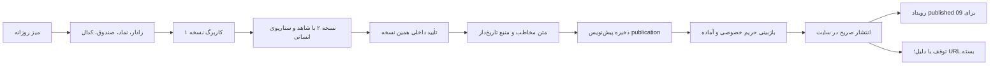

# NEXT-08 — میز روزانه و دفتر انتشار مخاطب‌دار

تاریخ ساخت و آزمون: 2026-09-30، تهران. شاخه `codex/next-08-desk-20260930`، پایه ایزوله `f6cb560478d51d48dcee2c9b2801eb047f5c7214`؛ این پایه main=`51fd066` و PR168=`3462f01` را برای بازاستفاده یک‌جا دارد. پایه PR تحویل `codex/wave-02-base-20260930` است؛ این کار ادغام PR168 در main یا نصب Production را اثبات نمی‌کند.

تحویل بازبینی: [PR176](https://github.com/safariarash7777-source/portfolio-platform/pull/176)، نسخه کد و شواهد `09271557376142b465ceb4c4e2da6409da200c9f`، پایه `f6cb560478d51d48dcee2c9b2801eb047f5c7214`. این ثبت تحویل فقط سند را به‌روز می‌کند؛ نتایج آزمون متعلق به همان نسخه کد هستند.

پیاده‌سازی داخلی آماده بازبینی است. هیچ ارسال تلگرام، AI اجباری، شرط تجاری تازه، ثبت‌نام واقعی یا migration محیط واقعی انجام نشده است. نصب دفتر انتشار به phase34 و migration04=`20260930182629_seasonal_course_membership.sql` وابسته است؛ بدون آن API خطای صریح unavailable می‌دهد.

بازخوانی تازه هماهنگ‌کننده: PR173=`7f915e3` اکنون phase38 ترازنامه دارد؛ هم‌پوشانی شماره phase37 در سند قدیمی سابقه است، نه نام فعلی PR173. نصب/سازگاری phase38 و migrationهای04/08 در محیط ترکیبی باید گیت ادغام را طی کند؛ این شاخه فقط پایه f6cb560 را دارد و compatibility کامل PR173 را ادعا نمی‌کند.

## تجربه و بازاستفاده

`/admin/desk` مقصد شروع روزانه باقی ماند. شش سؤال و موتورهای موجود حفظ شدند؛ یک مسیر پنج‌سؤالی «چه تغییر کرده/کدام داده معتبر نیست/چه چیزی نیاز بررسی دارد/کدام سناریو تغییر کرده/چه خروجی منتظر انتشار است» به رادار، سلامت موجود، پژوهش و دفتر انتشار وصل شد. نبود داده صف با صفر جایگزین نمی‌شود. شمارش صف، محدود به آخرین ۲۰۰ محتوای مستقل و آخرین ۵۰۰ ردیف کاربرگ است و آمار کل سامانه نیست.

در هر ردیف رادار، مقصد واقعی نماد و «بررسی با منبع این نماد» وجود دارد. `/admin/research?source=/symbol/...` یا `/market/funds` یا `/codal` فقط URL منبع و پرسش اولیه را می‌گذارد؛ تاریخ، عدد، تفسیر یا سناریو از snapshot استنتاج نمی‌شود. `/admin/fx`، `/admin/intelligence`، صندوق، نماد و کدال همان موتور موجودند. داده یا نمودار BrsApi دیگری ساخته یا فراخوانی نشده است. کیفیت تاریخ/NAV/واحد مطابق محدودیت NEXT02 باقی است.

phase34 و API `/api/admin/intelligence/workbooks` مرجع یگانه نسخه پژوهش و تصمیم انسانی است. ورود از picker عنوان/نسخه به همین کاربرگ برمی‌گردد؛ هویت، approval یا محاسبات دیگری ساخته نشد. انتخاب مخاطب و کانال، تایپ دستی متن مخاطب و دلیل اقدام در `/admin/publications` انجام می‌شود. UUID پشت picker است؛ تاریخ منبع native date picker دارد و تاریخ اقدام/دوره با formatter تهران موجود نمایش داده می‌شود.



## مرز دسترسی و نسخه

| داده/عمل | مجوز | نتیجه |
|---|---|---|
| میز، پژوهش، پیش‌نویس، queue، دلیل و تاریخ داخلی | `profiles.role=admin`؛ بررسی API و SQL مستقل | عضویت آموزشی آن را عمومی نمی‌کند |
| پیش‌نویس یا آماده | حتی عضو دوره اجازه مشاهده مخاطب ندارد | API مخاطب 404؛ لینک حدس‌زده نیز بسته |
| انتشار عمومی | published + آخرین publication + آخرین workbook با آخرین تصمیم approved_internal | anon/auth فقط متن allowlist مخاطب |
| انتشار دوره A | شرط بالا + RPC04 `seasonal_module_access('resources',A).allowed` | A مجاز؛ B یا legacy full یا admin بدون grant A مجاز نیست |
| خواندن ماشینی09 | EXECUTE محدود service_role و `auth.role()=service_role` | فقط published معتبر؛ آماده/کهنه/تأیید برگشته null |
| نیازسنجی | admin + RPC04 | تعداد پاسخ، موضوع‌ها، پرسش‌ها؛ بدون شناسه/تماس/اطلاعات مالی |
| پرونده و موعد مشاوره | رابطه/رضایت existing phase35/36 | admin جای رضایت مشتری نمی‌نشیند |

ثبت نسخه تازه انتشار، URL نسخه قبلی را فوراً نامعتبر می‌کند؛ حتی اگر نسخه جدید پیش‌نویس باشد. این رفتار محافظه‌کارانه آگاهانه است: نسخه قبلی پس از اصلاح مخاطب عمومی نمی‌ماند. همان publicationId ثابت و version افزایشی، اصلاحیه را نگه می‌دارد. تأیید متعلق به workbookVersionId دقیق است؛ نسخه جدید پژوهش یا تصمیم returned، انتشار قبلی و resolver09 را متوقف می‌کند. برگشت تأیید به معنی پاک‌کردن تاریخچه نیست؛ برای تأیید دوباره، نسخه پژوهش تازه بسازید چون phase34 تأیید تکراری یک نسخه را محدود می‌کند.

لغو انتشار فرمان append-only است؛ reason و actor از نشست ثبت می‌شوند. پایان grant منابع، لغو دوره و لغو grant فقط اجازه خواندن private publication را می‌بندند. هیچ تابع این تسک پرونده، نیازسنجی، نسخه پژوهش یا تاریخچه انتشار را حذف نمی‌کند. داده‌ای که قبلاً در مرورگر یا پیام ارسال‌شده دیده شده از راه حذف URL پس گرفته نمی‌شود؛ 09 باید این محدودیت را در طراحی اصلاحیه لحاظ کند.

## قرارداد API

همه APIهای جدید `private, no-store` هستند. پاسخ خطا از SQL یا secret خام عبور نمی‌کند. خطای نسخه/کلید 409، مجوز 401/403، عدم دسترسی محتوا 404، اعتبارسنجی 422، نبود زیرساخت 503؛ سقف POST انتشار 110KB.

| مسیر | عمل/خروجی |
|---|---|
| `GET /api/admin/intelligence/publications` | `contractVersion:publication.v1,items,workbooksState/workbooks,cohortsState/cohorts`؛ تازه‌ترین نسخه هر محتوا؛ status از یک RPC admin list، بدون N+1 |
| `POST` همان مسیر | `action:save,publicationId:null|uuid,baseVersion:int,draft,idempotencyKey:uuid` → 201 receipt version UUID |
| `POST` همان مسیر | `action:ready|publish|withdraw,versionId,reason,idempotencyKey,privacyConfirmed` → receipt command UUID |
| `GET /api/publications/:versionId` | فقط published/current مجاز: `{data:{id,publicationId,version,title,summary,content,contentKind,sources,audience}}` |
| `GET /api/admin/intelligence/course-needs?cohort=uuid` | `{state:available,data:{submittedCount,interests:[{topic,count}],questions}}` یا unavailable |
| `GET /api/admin/intelligence/requests` | حداکثر آخرین ۱۰۰ lead canonical برای admin؛ بدون ساخت سامانه موازی |
| `PATCH` همان مسیر requests | `id,updatedAt,status:new|contacted|converted|archived,notes`؛ optimistic updated_at، تعارض409 |

`draft` دارای `workbookVersionId,contentKind:brief|lesson|webinar_plan,title,summary,content,sources:[{url,asOf:YYYY-MM-DD}],audience:public|cohort,cohortIds:uuid[],channels:site|telegram[]` است. public دوره ندارد؛ cohort حداقل یک دوره published دارد؛ site همواره لازم است. URL دارای رمز، تاریخ ناممکن، منبع خالی، عنوان/متن نامعتبر و فیلدهای ناشناخته کنار گذاشته یا رد می‌شوند. API و SQL allowlist را مستقل بازسازی می‌کنند؛ actor، زمان، status و privateNote از payload پذیرفته نمی‌شوند.

تغییر publication بعد از ذخیره یک نسخه جدید می‌سازد. `ready` فقط از draft دارای تأیید معتبر و `privacyConfirmed=true`؛ `publish` فقط از ready پس از تأیید دوباره متن/مخاطب؛ `withdraw` فقط ready/published و دلیل لازم دارد، حتی اگر approval دیگر معتبر نباشد. آماده‌سازی یا ذخیره به معنی انتشار نیست. retry موفق همان actor/key/body همان receipt را برمی‌گرداند؛ actor/key با body متفاوت409. UI کلید را هنگام شکست شبکه حفظ می‌کند، دوبارکلیک را می‌بندد و خروج با متن ذخیره‌نشده هشدار دارد.

## قرارداد رویداد و تحویل به09

ثبت فرمان و رویداد در یک تراکنش SQL است؛ table `research_publication_events` append-only و unique(command_id). هیچ محتوا، نام، تماس، پاسخ نیازسنجی یا یادداشت خصوصی داخل envelope نیست.

```json
{
  "eventId":"00000000-0000-4000-8000-000000000001",
  "type":"publication.published",
  "contractVersion":"publication.v1",
  "aggregateRef":"00000000-0000-4000-8000-000000000002",
  "aggregateVersion":2,
  "occurredAt":"2026-09-30T19:30:00Z",
  "recordedAt":"2026-09-30T19:30:00Z",
  "correlationId":"00000000-0000-4000-8000-000000000003",
  "causationId":"00000000-0000-4000-8000-000000000004",
  "payloadRef":"00000000-0000-4000-8000-000000000005",
  "audience":"cohort",
  "cohortIds":["00000000-0000-4000-8000-000000000006"],
  "channels":["site","telegram"]
}
```

این JSON نمونه قرارداد است؛ UUID/زمان واقعی رویداد مشتری نیست. `publication.ready_for_distribution` تنها صف داخلی آماده‌سازی است و **نباید محرک ارسال09 باشد**. محرک مجاز توزیع `publication.published` است. `publication.withdrawn` برای لغو صف و اصلاحیه مصرف می‌شود.

RPCهای محدود09: `list_research_publication_distribution_events(p_after timestamptz,p_after_id uuid,p_limit 1..200)` فقط published/withdrawn و envelope+cursor را به service_role می‌دهد. cursor از `(created_at,id)` ساخته می‌شود؛ آخرین cursor را بعد از پردازش ذخیره کنید و replay را با eventId dedupe کنید. `resolve_research_publication_distribution(p_event uuid)` فقط published/current/approved را به `{envelope,sitePath,data:allowlist}` تبدیل می‌کند؛ آماده/متوقف/کهنه/برگشت‌تأیید null است. JWT role معتبر بررسی می‌شود؛ user_metadata منبع مجوز نیست. service_role روی table draft/history یا رویداد direct SELECT ندارد.

09 مالک ledger تحویل/retry، Telegram opt-in، نگاشت هویت verified، مجوز هر recipient در همان cohort و canonical URL است. پیش از send resolver را دوباره بخواند؛ نبود telegram در channels یعنی ارسال تلگرام ندارد؛ مخاطب cohort را به کانال عمومی تبدیل نکند. resolver علاوه بر envelope تاریخی، `effectiveCohortIds` از دوره‌های هنوز published می‌دهد؛ دوره draft/cancelled حتی با grant فعال مخاطب توزیع نیست. برای cohortها گیرنده‌های اجتماع را یک بار ارسال کند؛ withdrawn یا null را بدون retry ارسال متوقف کند. انتخاب channel=telegram در08 هیچ تماس با Telegram ندارد. لغو یا اصلاحیه نیازمند بازبینی09 است، نه حذف خودکار پیام قبلی.

## کارهای خدمت و نیازهای دوره

صف درخواست در `/admin/leads` جدول موجود `leads` را می‌خواند و status/notes موجود را با updated_at پیگیری می‌کند؛ نام/تماس فقط در نمای داخلی و هنگام پیگیری دیده می‌شود. new/contacted/converted/archived وضعیت CRM است، رزرو تأییدشده یا رابطه پرونده نیست. preferred_date/time از lead فقط «پیشنهادی» نمایش داده می‌شود. ساخت جلسه و اقدام موعددار به `/dashboard/consultation` موجود با RLS رابطه مشاور واگذار شده است؛ شمار موعدی که دریافت نشده ساخته نمی‌شود.

نیازسنجی توسط adapter04 فقط تعداد، موضوع علاقه و پرسش کوتاه latest submitted را می‌دهد؛ هدف آموزشی/تجربه/اطلاعات مالی فرد به گروه منتقل نمی‌شود. پرسش متن آزاد فقط admin است؛ هشدار حذف نام/مشخصات قبل از متن مخاطب نمایش داده شده. صفر پاسخ یک empty واقعی و خطای دریافت unavailable مستقل دارد. هیچ ارزیابی ریسک مالی از این adapter نتیجه نمی‌شود. محتوای `webinar_plan` از همین پرسش‌ها با تایپ دستی ساخته می‌شود، نه کپی خودکار.

AdminShell داخلی پیوندهای «دوره‌ها و ثبت‌نام»04، «محتوای دوره و دفتر انتشار»08 و «درخواست مشاوره و پیگیری» دارد. Navbar عمومی، globals و صفحه‌های عمومی فعال دست نخورده‌اند؛ مسیر `/publications/:id` جدید است و URL قبلی حذف یا تغییر نکرده است.

## شاهد و حدود پذیرش

آزمون‌ها در Postgres واقعی محلی container اختصاصی `portfolio-next04-synthetic-db` و DBهای منحصر NEXT08، داده مصنوعی، دو privilege profile legacy/explicit اجرا شدند؛ هیچ env secret، داده خصوصی یا تماس BrsApi خوانده نشده. DBها پس از آزمون حذف می‌شوند، container/root04DB تغییر نمی‌کند. migration08 با CLI Supabase2.117.0 تولید شده: `20260930182918_research_publication_queue.sql`؛ با شماره phase37 برخورد ندارد. ترتیب نصب: پیش‌نیازهای phase8/11/27، phase34، migration04، migration08. نصب04/08 در staging/Production همچنان مشروط به گردش مجاز همان محیط است.

- [log آزمون](./next-08-evidence/publication-tests.txt): ۲۶ PASS، صفر skip. چهار آزمون pure و ۱۱ سناریوی SQL/HTTP در هر دو profile؛ workbook v1/v2 از service واقعی saveWorkbook/decideWorkbook با fixture کامل و برچسب‌دار ذخیره/تأیید شد. HTTP loopback همان postPublication handler را به RPC PostgreSQL نشست مصنوعی متصل می‌کند؛ این شاهد واقعی Auth/REST سرویس جاری نیست. source04 نهایی SHA256=`509A6A8C17D47E26BD4ADFBE438E02F80B6DA225DA778B0F124825BFE4F9E71B` در log ثبت شده است.
- پوشش: unauth/nonadmin، direct table grants/RLS، audience A/B/expired، admin بدونgrant، draft/ready، old approval، public→cohort correction، withdrawal، old URL، returned approval، متادیتای جعلی role، replay/conflict، source sanitization/date و event atomicity/resolver.
- fixture [publication-fixture.ts](../../../lib/intelligence/publication-fixture.ts) عدد، بازده یا ادعای مشاهده بازار زنده ندارد؛ source example.invalid مصنوعی است. مسیرهای واقعی رادار/نماد/صندوق/کدال در کد برقرارند؛ صحت داده زنده و UI احرازشده آن‌ها از این fixture نتیجه نمی‌شود.
- typecheck و lint:ci کامل PASS؛ [build Next15.5.25](./next-08-evidence/build.txt) PASS، ۳۹ صفحه static؛ build با URL/key محلی مصنوعی انجام شده و دسترسی محیط واقعی را اثبات نمی‌کند. یک warning cache درباره رشته بزرگ webpack بود؛ خطای build یا type نبود.
- [آزمون بازاستفاده](./next-08-evidence/reused-tests.txt): ۳۳ PASS در workbook-store/research checklist، ناوبری میز، formatter تهران و tokenهای UI؛ ذخیره ناقص، نسخه دوم، تأیید کهنه و محافظت متن قبلی همان قرارداد موجود را حفظ می‌کنند. اسکن secret و `git diff --check` نیز PASS.
- [آزمون production boundary](./next-08-evidence/production-boundary.txt): با `NEXT08_QA=1`، QA در production404؛ UUID نامعتبر API404/private no-store؛ `/admin/publications` مهمان307 به login با next صحیح.
- Chrome واقعی با skill مرورگر و مالک UI05 آزموده شد: نسخه۲ fixture → سه متن مصنوعی → cohort/site+telegram → save v1 → reason/privacy → ready (هنوز خصوصی) → reason/privacy تازه → publish/native confirm → withdraw/reason. این مسیر UI state و عدم ارسال از ابزار را نشان می‌دهد؛ داده آن transport مصنوعی مستقل از DB است. ۱۱ تصویر در [پوشه شواهد](./next-08-evidence)؛ نمونه [ready خصوصی](./next-08-evidence/qa-ready-private-1440.png)، [published دسکتاپ](./next-08-evidence/qa-published-1440.png)، [published موبایل](./next-08-evidence/qa-published-390.png)، [withdrawn](./next-08-evidence/qa-withdrawn-390.png)، [empty](./next-08-evidence/qa-empty-390.png)، [error](./next-08-evidence/qa-error-390.png).
- [geometry1440](./next-08-evidence/qa-geometry-1440.json) و [geometry390](./next-08-evidence/qa-geometry-390.json): عرض صفحه/client/scroll برابر، فونت loaded. Tab به «میز روزانه» رفت و focus outline2px دیده شد؛ [شاهد صفحه‌کلید](./next-08-evidence/qa-keyboard-1440.png). تاریخ/URL/code در ورودی انسان اجباری نیست؛ متن منبع و تاریخ در picker مشاهده شد. کنتراست عددی جامع یا تجربه UI احرازشده اصلی از این QA نتیجه نمی‌شود.
- [سناریوی زمان‌دار](./next-08-evidence/qa-timed-scenario.json): 52.323 ثانیه، Date.now پیش از انتخاب پژوهش نسخه۲ تا Date.now پس از توقف publication نسخه۱؛ انتخاب متن/مخاطب/کانال، ذخیره، reason/privacy آماده، reason/privacy تازه و native confirm انتشار، دلیل توقف همگی checkpoint دارند. این زمان اجرای خودکار مرورگر با فاصله ابزار است؛ زمان یک انسان یا کار با DB واقعی نیست. زمان اولین برداشت تصاویر ثبت نشده و UNKNOWN می‌ماند.

اجرای دوباره محلی: `NEXT04_MIGRATION` فقط مسیر migration04 sibling را تعیین می‌کند؛ در checkout ترکیبی نیازی به override نیست. سپس `tsx --test --test-concurrency=1 lib/intelligence/publication.test.ts lib/intelligence/publication.integration.test.ts`. Docker transport ثابت این فایل تنها container مصنوعی04 و DBهای next08_publication_legacy/explicit را می‌پذیرد.

صفحه `/qa/next08` فقط development + `NEXT08_QA=1`، با همان Workbench و transport مصنوعی، empty/error و نمونه آماده را نشان می‌دهد. در build production حتی با flag=1، 404 است و auth gate هیچ مسیر admin را دور نمی‌زند. fixture UI شاهد Postgres/عضویت/Auth واقعی نیست. تغییرات دستی بدون AI قابل استفاده‌اند.

## تصمیم‌ها و کار باقیمانده محیط

1. سیاست تجاری D034 هنوز باز است؛ دفتر انتشار از grant واقعی04 می‌خواند و تاریخ سه‌ماه تازه تعیین نمی‌کند.
2. strict latest publication/workbook برای بستن نسخه قبلی اجرا شده؛ اگر مالک خواست نسخه قدیمی تا اصلاحیه جدید visible بماند، تصمیم صریح و تغییر contractVersion لازم است؛ تلقی ضمنی به «همه نسخه‌ها مجاز» نشود.
3. actor admin مجوز داخلی است؛ نقش مشاور و کانال opt-in جدا و existing باقی می‌ماند. نام شریک بیرونی، AI و اتصال اختصاصی مانع ابزار دستی نیست.
4. میز خدمت فهرست100/صف200 محدود است؛ گزارش کامل/جست‌وجوی تاریخی و تجربه موعد مشاور همان مسیر موجود است، نه شمار ساختگی در میز.
5. QA احرازشده روی سرویس جاری و نصب migrationها، بررسی بازبینی متن/حریم خصوصی به دست مالک، و ارسال09 هنوز انجام نشده‌اند؛ برای PR بعدی شرط وابستگی04 و168 صریح بماند.
