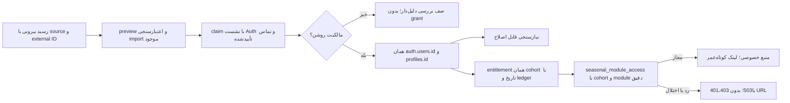

# P01 — قرارداد نشست و دسترسی؛ تحویل ایزوله 2026-10-02

اصلاح مستقل آمادهٔ بازبینی است؛ **پذیرش کامل P01 و ورود مالک در Production باز است.** این تحویل FOLLOWUP-01/07 را دوباره نمی‌سازد: اصلاح‌های179/190 در پایهٔ منتخب حاضرند؛ همان UUID، profiles، entitlements، رسید ثبت‌نام و قراردادهای `seasonal.v0.1` و Auth v1 مصرف می‌شوند. خطای سرویس با نشست ردشده یکسان نمی‌شود؛ هیچ مجوزی از خطای Auth ساخته نمی‌شود.

## مبنا و مالکیت

ورودی: اسناد بدون تغییر `product-plan-v0.1/00-start-here.md`، `01-product.md`، `03-delivery-plan.md`، `04-handoff.md` و P00-BASELINE، README مشترک، CLAUDE/API، COMMAND-CENTER و AUTH-MOBILE-IMPLEMENTATION. P00 پایهٔ ایزوله را195 تعیین کرده؛ این انتخاب دستور merge/Production نیست.

| مرجع | نسخهٔ مشاهده‌شده | کاربرد |
|---|---|---|
| main | `51fd0661d48d791ce8758a87828a81ce72cac6df` | مقایسهٔ وضعیت؛ مبنای ساخت جدید نیست |
| PR195؛ پایهٔ منتخب P00 | `31c44ab635b672b589b7833bcbc78b41d36f1e75`؛ tree `b891e09732872b16768317b506bfb9910cb0fdbf` | شامل191 و اصلاح‌های179/190؛ دوباره اعمال نشوند |
| PR179 / PR190 | `ca27b94a44f9a37785df059574a754e170880aac` / `a92e184a018d7a0da8fffaa9bb981e57a5489769` | Node middleware و تفکیک API موجود |
| PR180 / PR175 / PR184 | `bb4f2f3e53859bbecb0ec942975ffb06fd2d2828` / `bb7c2f9f89ea48929b6fd13a9dc9b16d58efa8a6` / `51ad615b116c7b1283404a60ee1d2081c11c96ca` | هویت/کانال، رسید/دوره، منبع خصوصی موجود |
| PR191 | `a83f71d922a93ec2bfb398a306d7b282ce1db81f` | جد195؛ فید و نیازهای مصرف‌کننده |
| PR199؛ ظاهر تأییدشده | `e1c46e3e0a7d9fb416d7c58acba4d55d569e22de` | شاخهٔ مستقل حفظ شد؛ این patch آن را جایگزین نمی‌کند |
| P01؛ commit کد | `87f6b2250218c661fc3a6ab89fec10d35f6a7467` | فقط patch این تحویل؛ branch `codex/p01-session-contract-20261002` |

هش P00-BASELINE خوانده‌شده: `D81810421BD3FD12E0A48830E1C4BA26BE2BD66DD7D31BF22A62343DEB755E1B`؛ هش03-delivery-plan: `585785092B6D89ED8C0623073C1E27E28F7395E9DD4F50883F294EA43E794CA5`. sourceِ plan در checkout مالک P00 خوانده شد؛ نسخۀ قدیمیِ احتمالی در195 مرجع تصمیم جاری نیست.

P01 مالک Auth/middleware و قرارداد خطا است. تغییر کد: middleware، callback، session/email/mobile API، helper خطای Auth، seasonal server/resource guard و یک پیام callback در login. تغییر تست: VM harnessهای موجود و38 آزمون جدید. package.json، lockfile، workflow، schema، globals، فونت، Navbar و موتور مالی تغییر نکردند. پایه195 کد پوسته177 را در ancestry دارد؛ این واقعیت تأیید طراحی177 یا تحویل آن نیست. P00 باید اصلاح199 را جدا با مالک پوسته ترکیب کند، بدون merge کامل177/188.

## مسئله و رفتار حاصل

پایه195 همهٔ خطاهای4xx نشست، از جمله404/429، را401 می‌کرد؛ refresh هر خطای SDK را خروج از حساب نشان می‌داد. خطای Auth در مسیر منابع/دوره در همه جا طبقه‌بندی مشترک نداشت. callbackِ ناموفق next و کوکی/هدرِ به‌روزشده را از دست می‌داد. set-password نتیجهٔ خطای getClaims را بررسی نمی‌کرد. در خطای provider/پاسخ غیرJSON، OTP یا لینک سالم «نامعتبر» معرفی می‌شد.

اکنون تمام این مرزها از helper موجود مصرف می‌کنند. timeoutِ middleware و callback هشت ثانیه است؛ خطای ساخت کلاینت هم داخل gate قرار دارد. رد/اختلال قبل از خواندن نقش، RPC خصوصی، updateUser یا writer privileged متوقف می‌شود. کوکی‌های SDK و cache-control/expires/pragma در redirect حفظ می‌شوند؛ پاسخی که کوکیِ نشست می‌دهد قابل cache عمومی نیست. next از helper موجود مسیر محلی امن عبور می‌کند؛ code بازیابی به مقصد خطا منتقل نمی‌شود. موفقیت refresh/signout همچنان `{ok:true}` است و signout فقط scope محلی دارد.

| مرز | وضعیت قابل مشاهده | معنای قرارداد |
|---|---|---|
| getUser/refresh؛ SDK SessionMissing یا401/403 |401|نشست لازم/ردشده؛ هیچ خواندن خصوصی |
|400 با کد مشخص bad_jwt/no_authorization/session_expired/session_not_found/refresh_token_not_found/refresh_token_already_used/flow_state_expired/flow_state_not_found|401|رد/انقضای صریح نشست یا exchange؛ code مبنا است |
|400 نامعلوم،402،404،429،5xx، خطای تنظیمات/transport/nonJSON|503|خدمت فعلاً قابل بررسی نیست؛ ناشناس فرض نشود |
|status API؛ نشست مفقود|200 با authenticated=false|قرارداد قبلی status حفظ شده؛ با outage503 فرق دارد |
|OTP/password action؛400/401/403/422 معمولی|400|ورودی/credential ردشده؛ به معنی revoke همه نشست‌ها نیست |
|OTP/password action؛429|429|محدودیت تلاش؛ ورودی فرم حفظ شود |
|OTP/password action؛provider disabled، hook timeout، sms_send_failed، سایر خطای سرویس|503|ارائه‌دهنده/شبکه؛ ارسال یا completion ادعا نشود |
|بازیابی ایمیل|200، receipt شرطی و یکسان|«اگر حسابی وجود داشته باشد…»؛ اثبات ارسال یا وجود حساب نیست؛ شکست در metric داخلی ثبت می‌شود |
|middleware/callback|redirect با next امن|عدم دسترسی یا unavailable صریح؛ HTTP redirect به‌تنهایی status سرویس upstream نیست |

خطای action از `authActionFailure` و خطای session فقط از `authSessionFailure` مصرف شود. helper جدید سرویس/جدول هویت دوم ایجاد نمی‌کند. endpoint و contractVersion عوض نشده‌اند. جدول تجمیعی و شواهد در [EVIDENCE.json](p01-session-contract/EVIDENCE.json) و [ACCESS-MATRIX.csv](p01-session-contract/ACCESS-MATRIX.csv) هستند.

## هویت، دوره و منبع — مصرف قرارداد موجود



ثبت‌نام/پرداخت/نقش/رضایت مشاوره چهار مفهوم مستقل‌اند. نوشتن شماره/ایمیل یا external registration ID اثبات مالکیت حساب دیگر نیست. import API رسمی شریک هنوز معلوم نیست؛ preview/commit CSV موجود با گزارش dedupe مصرف شود؛ endpoint شریک ساخته نشد. `seasonal_module_access` مجوز همان دوره/ماژول را می‌سنجد؛ admin بدون grant از API منبع خصوصی عبور نمی‌کند. مسیر admin عملیاتی مجوز جدا دارد.

| سناریو | پاسخ مشخص قرارداد | شاهد این تحویل و محدودیت |
|---|---|---|
|ثبت‌نام موفق|claim با تماس تأییدشده به UUID موجود؛ entitlementِ دوره و منابع همان module|کد/fixture/RLS بسته175/184 موجود؛ مسیر401/503 guard در این نوبت آزموده شد؛ چرخه DB جدید هنوز پذیرش مستقل لازم دارد |
|ثبت‌نام تکراری یا retry|همان source/external ID؛ receipt و ledger idempotent؛ تمدید دوباره ممنوع|ساختار موجود تغییر نکرد؛ پذیرش DB در sandbox P00 تکرار شود |
|دو دوره|هر دوره زمان و grant جدا؛ انتخاب cohort مجوز دوره دیگر نمی‌سازد|پارامتر cohort در RPC دقیق؛ آزمون HTTP موجود؛ مشتریA/B در DB جدید لازم است |
|دیرهنگام|فقط policy صریح cohort؛ بدون سه ماه خودکار از زمان claim|D-034 باز؛ fixture انتخاب صریح؛ policy تجاری Production فعال نشد |
|منقضی|در ends_at دسترسی دوره/منبع رد؛ پرونده و دارایی حذف نمی‌شود|بازه نیمه‌باز و access-standing در آزمون موجود؛ UI سابقه تابع تصمیم تجاری باز است |
|لغوشده/بازپرداخت|revoke دلیل‌دار و تاریخچه؛ درخواست API بعدی رد؛ پایان حساب نیست|SQL/guard موجود؛ URL امضاشده قبلی تا حداکثرTTL60 ممکن است معتبر بماند؛ ادعای revoke آنی URL نداریم |
|حساب نامرتبط|تماس تأییدنشده/ناسازگار به review یا rejection؛ بدون claim/grant|نه user جدید نه admin موقت؛ پذیرش مستقیم API/RLS لازم است |
|مشاوره مستقل|رضایت و خدمت مشاوره مستقل؛ عضویت یک دوره از آن استنتاج نمی‌شود|قرارداد موجود حفظ؛ مشتری مشاوره بدون grant دوره منبع آن دوره را نمی‌گیرد |

مدت از قرارداد قبلی با policyِ مشخص و نسخه‌دار محاسبه می‌شود؛ شروع cohort یا claim و سه ماه تقویمی/90روز هنوز تصمیم تجاری‌اند. آزمون تاریخ/مرز/تهران در `lib/seasonal/seasonal.test.ts` و standing موجود گذشت؛ گذشتن fixture اجازهٔ انتخاب سیاست Production نیست. اعطا/لغو/تمدید دستی دلیل و ledger موجود دارند. نیازسنجی همان تجربه/علاقه/هدف/پرسش است؛ ارزیابی تخصصی ریسک معرفی نشد.

## وضعیت محیط، schema و بکاپ — شاهد تازه

**Production اصلی**: گزارش قبلی FOLLOWUP-01 و incident Direct-IP نگه داشته شد. علت قطعی issuer پاسخ غیرJSON هنوز معلوم نیست؛307 middleware را خطای HTTP upstream نمی‌نامیم. ورودهای مدیر در Auth در گزارش قبلی شاهد تاریخی‌اند، نه پذیرش امروز روی patch جدید. وضعیت passwordpresent/emailconfirmed/ban/provider از همان گزارش است؛ این نوبت password/hash/UUID/credential مالک دوباره خوانده یا تغییر نکرد.

**سرویس موجود لیارا؛ فقط‌خواندنی در2026-10-02 17:03 تهران**: auth.users/profiles/entitlements حاضر؛ course_cohorts، course_resources، needs_assessment_versions و identity_private.profile_versions غایب. بازبینی canonical در13:35:24 UTC نیز نبود `publication_private.research_publication_reads` را ثبت کرد. پس این سرویس با schema پایه195 هم‌سطح فرض نمی‌شود. query اولیهٔ نام غیرcanonicalِ جدول خواندن publication وارد نتیجه نهایی نشده است.

pg_cron حاضر، شمار cron.job کل/فعال/backup هر سه صفر. root crontab قابل خواندن نبود؛ نبود job در آن اثبات نشده. timer عمومی backup فقط `dpkg-db-backup.timer/service` بود؛ بکاپ بسته‌های سیستم، شاهد بکاپ برنامه نیست. timer نام‌دار portfolio صفر است؛ دیگر زمان‌بندی‌ها UNKNOWN. فایل رمز‌شدهٔ مستند سپتامبر حاضر،413,798,850byte و mtime2026-09-30 17:48:26 تهران؛ امروز hash/restore سنجیده نشد. **fresh backup، restore قابل بازتولید و زمان‌بندی برنامه بازند**؛ وجود فایل یا restore قدیمی کافی نیست. هیچ DB/service write در این بررسی انجام نشد.

**sandbox مستقل P00**: طبق خروجی مالک محیط `portfolio-accept195` در `https://62.60.191.24:8443`، applicationSHA31c44ab و GoTrue2.197.0، DB تازه و18migration با Git canonical hash نصب شده‌اند. این شواهد ثانویه‌اند؛ این عامل نصب را اجرا نکرد. snapshot مرورگری خوانده‌شده13:36:54–13:42:00 UTC،29PASS/1FAIL (execution-admin) داشت. ورود/نقش/reload/refresh/خروج/ورود و جدایی مرورگرA/B/adviser ثبت شد؛ admin تا refresh گذشت. علت FAIL از status صرف استنتاج نمی‌شود. hash فایل مشاهده‌شده `225432993C6C5C4452659C7E3340F4C577C3BD3A4034D2F0B442A257898CFB83`. نتیجه جاری ممکن است در گزارش P00 بعداً عوض شود.

این محیط **patch87f6b22 را اجرا نکرده**؛ حساب‌های آن ساختگی‌اند و ورود مالک در سایت اصلی نیستند. HTTP200، native token یا رسید ارسال به‌تنهایی پذیرش SSR/مالک/بازیابی را کامل نمی‌کند. P00 تنها مالک نصب/محیط است؛ infra دوم نساختیم.

## آزمون بازتولیدپذیر

Node24.19.0، auth-js2.105.1، @supabase/ssr0.10.2، Next15.5.25؛ dependency تازه نصب/ارتقا نشد. اجرای محلی از Node موجود و node_modules موجود بود.

| مجموعه | نتیجه | نوع شاهد |
|---|---|---|
|P01 جدید|38PASS؛0FAIL؛0skip|handler واقعی TS درVM؛ SDK error واقعی و transport canned؛ بدون server/DB/account writes |
|همین38 بر baseline31c44ab|8PASS؛30FAIL|شاهد red برای defects؛ اجرای عمدی baseline خروجی1 دارد |
|Auth/session + seasonal resource + SMS core|61PASS؛0FAIL؛0skip|شامل38 بالا،8Auth قبلی،8resource،7SMS؛ شمارش دوباره نشود |
|Auth/mobile/email، seasonal، access-standing، returnPath/loginFlow و memberhome|47PASS؛0FAIL؛0skip|آزمون تابع/قرارداد؛ جمع کل108 |
|typecheck، eslint --max-warnings=0، next build|PASS|47صفحه static؛ بدون اجرای server یا استقرار |
|اسکن سکرت و diff --check|PASS|نه مقدار credential در artifact، نه تغییر SQL |

```sh
node --test scripts/testing/auth-session-handler.test.mjs scripts/testing/seasonal-resource-handler.test.mjs services/auth-sms/core.test.mjs
node node_modules/tsx/dist/cli.mjs --test lib/auth/mobile.test.ts lib/auth/email.test.ts lib/seasonal/seasonal.test.ts lib/access-standing.test.ts components/account/returnPath.test.ts components/account/loginFlow.test.ts lib/member/home.test.ts
node scripts/testing/p01-session-contract.test.mjs --baseline
node node_modules/typescript/bin/tsc --noEmit
node node_modules/eslint/bin/eslint.js . --max-warnings=0
node node_modules/next/dist/bin/next build
```

دستورbaseline مستقیم است؛ برای کنترل تاریخی،38test را با `node --test ... --baseline` اجرا نکنید. آزمون جدید از فایل auth-session-handler.test.mjs وارد می‌شود، پس script موجود `test:auth-mobile` درCI آن را می‌گیرد؛ تغییر package مشترک لازم نشد. auth-cookie-regression harness فقط import dependency جدید گرفت و این نوبت اجرا نشد؛ تست جدید cookie/header/next را پوشش می‌دهد. nativeRLS/Storage و browser جدید با این108 برابر نیستند.

## مصرف‌کنندگان، موانع و rollout

**P03**: `publicationMember` در lib/intelligence/publication-server.ts و `memberAuthErrorStatus` در lib/member/http.ts هنوز mapping محلی دارند؛400ِ session expired را مثل helper مشترک تفسیر نمی‌کنند. مالکP03 باید helper موجود را مصرف کند و رگرسیون401/503 بگذارد؛ این فایل‌های مشترکِ واگذارشده در این patch ویرایش نشدند. error null در UI reader نباید 401 تصور شود. guard مالیِ lib/portfolio/financialHttp.ts به مالکP04 واگذار است. admin publication نیز در تحویل P07 باید نشست/نقش/اختلال را جدا کند؛ سیاست مجوز دوم ساخته نشود.

**FOLLOWUP-07**: adapter server-only و signed hook، محدودیت هزینه/تلاش و mock ممنوع درProduction موجودند؛ این patch آن‌ها را بازنویسی نمی‌کند. SMS تجاری DEFERRED: حساب/مدارک/قرارداد و رمز توسط مالک، تأیید قالب `arashlogin` و کلید در محیط امن، بودجه مشخص و OTP واقعی هنوز شاهد ندارند. نام secretهای سرویس بدون مقدار: `SEND_SMS_HOOK_SECRET`، `AUTH_SMS_CONTROL_SECRET`، `AUTH_SMS_FINGERPRINT_SECRET`، `KAVENEGAR_API_KEY`، `KAVENEGAR_TEMPLATE`؛ جزئیات [README سرویس](../../../services/auth-sms/README.md). SMTP/ارسال recovery واقعی هم UNKNOWN و شرط receipt200 دلیل تحویل ایمیل نیست. پایان SMS مانع بررسی password موجود نیست. ورود legacy email حفظ شد؛ شاهکار/ثبت‌احوال pending باقی است. ریسک signup legacy و metadata حساسِ گزارش07 هنوز گیت فعال‌سازی ثبت‌نام واقعی است، این patch آن را بسته نمی‌نامد.

**P00، مرحله بعدی مشخص**:

1. فقط commit کد87f6b22 روی manifest ثابت اعمال شود؛179/190/191/195 تکرار نشوند. مالک P00 ترکیب199 و اضافه‌های مستقل package را ثبت کند؛ این patch package را عوض نکرده است.
2. روی sandbox مجاز، candidate همان SHA دوباره build و applicationSHA/source tree ثبت شود. browser bundle و server به **یک** backendِ ساختگی برسند؛ زوج override/public-key هم‌مقصد، service-role همان پروژه، SiteURL/callback، CSP/CORS/TLS با Boolean/metadata فاقد مقدار secret سنجیده شوند. sandbox195 مسیر جایگزین برای startup/preview ردشده199 نیست.
3. catalog/hash18migration، native Auth/Storage، grants/RLS و bucket خصوصی تأیید شوند. این patch migration تازه ندارد؛ زنجیره195 و identity/resource قبلی را طبق plan P00 فقط در مقصد مجاز مصرف کنید.
4. native browser ورودA، نقش/refresh/reload/logout/relogin و next؛B/admin بدون module grant؛ دوcohort؛ claim تکراری؛contact ناسازگار؛ مستقیمAPI/RLS؛ revoke و انقضا روی درخواست بعدی آزموده شوند. recover/email delivery، registration confirmation و expired/replayed links با سرویس واقعی مجاز سنجیده شوند. VM جای این پذیرش نیست.
5. تازه‌بودن بکاپ و restore در محیط مستقل، زمان‌بندی واقعی و alert شکست را قبل rollout ثبت کنید. سپس rollout محدود و توقف/بازگشت؛ Production و credential مالک فقط در بستهٔ مجاز جدا. پذیرش مالک روی URL اصلی باید خودش انجام دهد؛ رمز یا Google credential به چت نیاید.

Rollback این patch: buildِ شناخته‌شدهٔ قبلی و snapshot تنظیماتِ تأییدشدهٔ همان محیط؛ rollback کدِ patch به31c44ab مرجع مقایسه است، اثبات سلامت Production آن نیست. schema/UUID/profiles/سوابق/رضایت/دارایی حذف یا recreate نشوند. دستور resetDB یا credential در artifact وجود ندارد. policy مدت/قیمت/پس از انقضا D-034، پرداخت D-024، بودجهSMS و گیت واقعیAuth/provider باز می‌مانند.

ابزار استفاده‌شده: PowerShell/Git، Node/tsx/TypeScript/ESLint/Next، SSH Python فقط catalog/aggregate، metadata GitHub و خواندن artifact P00. مهارت‌های Supabase و Next.js خوانده/مصرف شدند. مرجع قرارداد جاری SDK: [SSR و cache/cookies](https://supabase.com/docs/guides/auth/server-side/creating-a-client?queryGroups=framework&framework=nextjs)، [خطاهای Auth](https://supabase.com/docs/guides/auth/debugging/error-codes)، [password/recovery](https://supabase.com/docs/guides/auth/passwords). نسخه API/client ارتقا داده نشد. استقرار/merge/Production migration، حساب/admin جدید، OTP/JWT ثابت/دستی، خواندن private مشتری و خرید/شارژ/پیام به اعضا انجام نشد.
